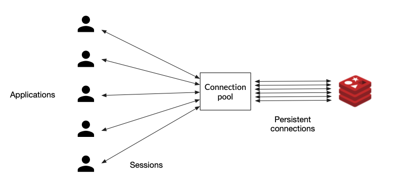

### Tune beore you scale 

### Prologue 
Time and money are two major factors which drive people forward. Oftentimes one either loses time or money and vice versa. On a sunny day, when a field trip is ruined by a broken car right in the way, what will you lose? It's your temper... 

This article is created from transscript of [RU301](https://redis.io/university/courses/ru301/) verbatim, not because of my laziness. But for the great significance and unstirrable value in the aforementioned narrative of the course. Nevertheless links and addenda will be appended whenever it is appropriate. 


### I. Redis Server Overview
As you might already know, Redis is an open source data structure server written in C. You can store multiple data types like strings, hashes, and streams, and access them by a unique key name. 

All keys in the Redis database are stored in a flat key space. There is no enforced schema or naming policy, and the responsibility for organizing the key space is left to the developer.

The speed Redis is famous for is mostly due to the fact that Redis stores and serves data entirely from RAM memory instead of disk, as most other databases do.

Another contributing factor is the predominantly single-threaded nature. Single threading avoids race conditions and CPU-heavy context switching associated with threads. Indeed, this means that open source Redis
can't take advantage of the processing power of multiple CPU cores, although CPU is rarely the bottleneck with Redis.

You are more likely to bump up against memory or network limitations before hitting any CPU limitations. That said, Redis Enterprise does let you take advantage of all the cores on a single machine.

The reading and especially writing to a socket are expensive operations. So in Redis version 6.0, multi-threaded I/O was introduced. When this feature is enabled, Redis can delegate the time spent reading and writing to I/O sockets over to other threads, freeing up cycles for storing and retrieving data, and boosting overall performance by up to a factor of two for some workloads.


### II. The Command Line Tool: Redis-CLI
The Redis CLI is a command line tool used to interact with the Redis server. There are two ways to use the Redis CLI, an interactive mode where the user types commands and sees the replies, and another mode where the command is provided as an argument to Redis CLI, executed, and results are sent to their standard output.
```
redis-cli -h 172.22.0.3 -p 7000 
```
The arguments -h and -p are used to specify the host and port to connect to. They can be omitted if your server is running on the default host, localhost, port 6379. 

You can do much more with Redis CLI, like sending output to a file, scanning for big keys, get continuous stats, monitor commands, and so on.
```
redis-cli --pipe < MAX_INSERT_KEYS.txt 

redis-cli --bigkeys > BIG_KEY_REPORT.txt 

redis-cli MONITOR > COMMANDS.log
```


### III. Configuring a Redis Server
The self-documented Redis configuration file called `redis.conf` has been mentioned many times as an example of well written documentation. In this file you can find all possible Redis configuration directives, together with a detailed description of what they do and their default values.

You should always adjust the `redis.conf` file to your needs and instruct Redis to run based on it's parameters when running Redis in production.

The way to do that is by providing the path to the file when starting up your server:
```
$ redis-server./path/to/redis.conf
```
When you’re only starting a Redis server instance for testing purposes you can pass configuration directives directly on the command line:
```
$ redis-server --port 7000 --replicaof 127.0.0.1:6379
```
The format of the arguments passed via the command line is exactly the same as the one used in the `redis.conf` file, with the exception that the keyword is prefixed with --.

Note that internally this generates an in-memory temporary config file where arguments are translated into the format of `redis.conf`.

It is possible to reconfigure a running Redis server without stopping or restarting it by using the special commands `CONFIG SET` and `CONFIG GET`.
```
127.0.0.1:6379> CONFIG GET *

127.0.0.1:6379> CONFIG SET something

127.0.0.1:6379> CONFIG REWRITE
```
Not all the configuration directives are supported in this way, but you can check the output of the command `CONFIG GET *` first for a list of all the supported ones.

Note that modifying the configuration on the fly has no effects on the `redis.conf` file so at the next restart of Redis the old configuration will be used instead. If you want to force update the `redis.conf` file with your current configuration settings you can run the `CONFIG REWRITE` command, which will automatically scan your `redis.conf` file and update the fields which don't match the current configuration value.


### IV. Redis Clients


#### Basic Replication 

#### Replication with Sentinels 

### Sharded cluster 

### Summary 

### Bibliography 

### Epilogue 

### EOF 


The Command Line Tool: Redis-CLI
================================

Configuring a Redis Server
==========================


Redis Clients
=============
The Redis.io client page lists over 200 client libraries
for more than 50 programming languages.

Client Performance Improvements
===============================
Connection management - Pooling
As we showed in the previous section, Redis clients are responsible for managing connections to the Redis server. Creating and recreating new connections over and over again, creates a lot of unnecessary load on the server. A good client library will offer some way of optimizing connection management, by setting up a connection pool, for example.

With connection pooling, the client library will instantiate a series of (persistent) connections to the Redis server and keep them open. When the application needs to send a request, the current thread will get one of these connections from the pool, use it, and return it when done.



So if possible, always try to choose a client library that supports pooling connections, because that decision alone can have a huge influence on your system’s performance.

Pipelining
As in any client-server application, Redis can handle many clients simultaneously.

Each client does a (typically blocking) read on a socket and waits for the server response. The server reads the request from the socket, parses it, processes it, and writes the response to the socket. The time the data packets take to travel from the client to the server, and then back again, is called network round trip time, or RTT.

If, for example, you needed to execute 50 commands, you would have to send a request and wait for the response 50 times, paying the RTT cost every single time. To tackle this problem, Redis can process new requests even if the client hasn't already read the old responses. This way, you can send multiple commands to the server without waiting for the replies at all; the replies are read in the end, in a single step.


This technique is called pipelining and is another good way to improve the performance of your system. Most Redis libraries support this technique out of the box.


Initial Tuning
==============
We love Redis because it’s fast (and fun!), so as we begin to consider scaling out Redis, we first want to make sure we've done everything we can to maximize its performance.

Let's start by looking at some important tuning parameters.

`Max Clients`
Redis has a default of max of 10,000 clients; after that maximum has been reached, Redis will respond to all new connections with an error. If you have a lot of connections (or a lot of application instances), then you may need to go higher. You can set the max number of simultaneous clients in the Redis config file:
```
maxclients 20000
```

`Max Memory`
By default, Redis has no max memory limit, so it will use all available system memory. If you are using replication, you will want to limit the memory usage in order to have overhead for replica output buffers. It’s also a good idea to leave memory for the system. Something like 25% overhead. You can update this setting in Redis config file:
```
# memory size in bytes  
maxmemory 1288490188
```

`Set tcp-backlog`
The Redis server uses the value of tcp-backlog to specify the size of the complete connection queue.

Redis passes this configuration as the second parameter of the `listen(int s, int backlog)` call.

If you have many connections, you will need to set this higher than the default of 511. You can update this in Redis config file:
```
# TCP listen() backlog. 
# 
# In high requests-per-second environments you need an high backlog in order 
# to avoid slow clients connections issues. Note that the Linux kernel 
# will silently truncate it to the value of /proc/sys/net/core/somaxconn so 
# make sure to raise both the value of somaxconn and tcp_max_syn_backlog 
# in order to get the desired effect.
tcp-backlog 65536
```
As the comment in `redis.conf` indicates, the value of `somaxconn` and `tcp_max_syn_backlog` may need to be increased at the OS level as well.

`Set read replica configurations`
One simple way to scale Redis is to add read replicas and take load off of the primary. This is most effective when you have a read-heavy (as opposed to write-heavy) workload. You will probably want to have the replica available and still serving stale data, even if the replication is not completed. You can update this in the Redis config:
```
slave-serve-stale-data yes
```
You will also want to prevent any writes from happening on the replicas. You can update this in the Redis config:
```
slave-read-only yes
```

`Kernel memory`
Under high load, occasional performance dips can occur due to memory allocation. This is something Salvatore, the creator of Redis, blogged about in the past. The performance issue is related to transparent hugepages, which you can disable at the OS level if needed.
```
$ echo 'never' > /sys/kernel/mm/transparent_hugepage/enabled
```

`Kernel network stack`
If you plan on handling a large number of connections in a high performance environment, we recommend tuning the following kernel parameters:
```
vm.swappiness=0                       # turn off swapping
net.ipv4.tcp_sack=1                   # enable selective acknowledgements
net.ipv4.tcp_timestamps=1             # needed for selective acknowledgements
net.ipv4.tcp_window_scaling=1         # scale the network window
net.ipv4.tcp_congestion_control=cubic # better congestion algorithm
net.ipv4.tcp_syncookies=1             # enable syn cookies
net.ipv4.tcp_tw_recycle=1             # recycle sockets quickly
net.ipv4.tcp_max_syn_backlog=NUMBER   # backlog setting
net.core.somaxconn=NUMBER             # up the number of connections per port
net.core.rmem_max=NUMBER              # up the receive buffer size
net.core.wmem_max=NUMBER              # up the buffer size for all connections
```

`File descriptor limits`
If you do not set the correct number of file descriptors for the Redis user, you will see errors indicating that “Redis can’t set maximum open files..” You can increase the file descriptor limit at the OS level.

Here's an example on Ubuntu using systemd:
```
/etc/systemd/system/redis.service
[Service] 
... 
User=redis 
Group=redis 
...
LimitNOFILE=65536 
...
```
You will then need to reload the daemon and restart the redis service.

`Enabling RPS (Receive Packet Steering) and CPU preferences`
One way we can improve performance is to prevent Redis from running on the same CPUs as those handling any network traffic. This can be accomplished by enabling RPS for our network interfaces and creating some CPU affinity for our Redis process.

Here is an example. First we can enable RPS on CPUs 0-1:
```
$ echo '3' > /sys/class/net/eth1/queues/rx-0/rps_cpus
```
Then we can set the CPU affinity for redis to CPUs 2-8:
```
# config is set to write pid to /var/run/redis.pid
$ taskset -pc 2-8 `cat /var/run/redis.pid`
pid 8946's current affinity list: 0-8
pid 8946's new affinity list: 2-8
```

HW 1.1 Runninng redis-cli in command line mode allows sending output to a file, scanning for big keys, continuous stats, and monitoring.

HW 1.2 The CONFIG REWRITE command rewrites the redis.conf> file that the server was started with, applying the minimal changes needed to make it reflect the configuration currently used by the server. This may be different from the original file's contents because of the use of the CONFIG SET command.

HW 1.3 
When using a pipeline, Redis can process new requests even if the client hasn't already read the old responses. This way, you can send multiple commands to the server without waiting for the replies at all; the replies are read in the end, in a single step.

HW 1.4 
With connection pooling, the client library will instantiate a series of persistent connections to the Redis server and keep them open. When the application needs to send a request, the current thread will get one of these connections from the pool, use it, and return it when done.


Introduction to Persistence and Durability
==========================================
As I'm sure you know, Redis serves all data directly
from memory.
But Redis is also capable of persisting data to disk.
Persistence preserves data in the event of a server restart.


Persistence Options in Redis
============================
Redis provides two of them, snapshotting
and an append-only file, or AOF.
You can configure your Redis instance
to use either of the two or a combination of both.
When a snapshot is created, the entire point
in time via the data set is written to persistent storage
in a compact RDB file. You can set up recurring backups,
for example, every one, 12, or 24 hours,
and use these backups to easily restore
different versions of the data set in case of disasters. 

You can also use these snapshots to create a clone of the server
or simply leave them in place for a future restart. 
Creating an RDB file requires a lot of disk IO.
If performed in the main Redis process,
this would reduce the server's performance.
That's why this work is done by a forked child process.

But even forking can be time consuming
if the data set is large.
This may result in decreased performance
or in Redis failing to serve clients for a few milliseconds
or even up to a second for very large data sets.

Understanding this should help you
decide whether this solution makes
sense for your requirements.
You can configure the name and location of the RDB file

with the `dbfilename` and `dir` configuration directives,
either through the redis.conf file or through the Redis CLI
as explained in section 1 unit 3.
And of course, you can configure how often you want to create a snapshot.
Here's an excerpt from the redis.conf file showing
the default values. 

As an example, this configuration
will make Redis automatically dump
the data set to disk every 60 seconds if at least 1,000 keys
changed in that period.
While snapshotting it is a great strategy for the use cases
explained above, it leaves a huge possibility for data loss.

You can configure snapshots to run every few minutes
or after X writes against the database.
But if the server crashes, you lose
all the writes since the last snapshot was taken.
In many use cases, that kind of data loss can be acceptable.
But in many others, it is absolutely not.
For all of the other use cases, Redis
offers the AOF persistence option.

AOF, or Append Only File, works by logging every incoming write
command to disk as it happens.
These commands can then be replayed to server startup
to reconstruct the original data set.
Commands are logged using the same format as the Redis protocol
itself in an append only fashion.
The AOF approach provides greater durability

than snapshotting and allows you to configure
how often the syncs happen.
Depending on your durability requirements, or how much data
you can afford to lose, you can choose
which FYSNC policy is best for your use case:
FYSNC every write, the safest policy.
The write is acknowledged to the client
only after it has been written to the AOF

and flushed to disk.
Since in this approach, we are writing to disk synchronously,
we can expect a much higher latency than usual.
FYSNC every second, the default policy.
FYSNC is performed asynchronously
in a background thread.
So write performance is still high.

Choose this option if you need high performance
and can afford to lose up to one second worth of writes.
No FYSNC.
In this case, Redis will log the command to the file descriptor
but will not force the OS to flush the data to disk.
If the OS crashes, we can lose a few seconds of data.

Normally, Linux will flush data every 30 seconds
with this configuration.
But it's up to the kernel's exact tuning.
The relevant configuration directives for AOF
are shown on the screen.
AOF contains a log of all the operations
that modify the database in a format that's
easy to understand and parse.

When the file gets too big, Redis can automatically
rewrite it in the background, compacting it in a way
that only the latest state of the data is preserved.


Exercise - Saving a Snapshot
============================
As we learned in the previous unit, Redis will save a snapshot of your database every hour if at least one key has changed, every five minutes if at least 100 keys have changed, or every 60 seconds if at least 10000 keys have changed.

Let’s update this to a simplified hypothetical scenario where we want to save a snapshot if three keys have been modified in 20 seconds.

Step 1
Create a directory named 2.2 and in it prepare a redis.conf file.

$ mkdir 2.2
$ cd 2.2
$ vim redis.conf
The redis.conf file should specify a filename that will be used for the rdb file and a directive that will trigger the creation of a snapshot if 3 keys have been modified in 20 seconds, as described above.

dbfilename my_backup_file.rdb
save 20 3
Step 2
While inside of the 2.2 directory start a Redis server, passing it the redis.conf configuration file you just created.

$ redis-server ./redis.conf
In a separate terminal tab use the redis-cli to create three random keys, one after the other. For example:

127.0.0.1:6379> SET a 1
127.0.0.1:6379> SET b 2
127.0.0.1:6379> SET c 3
Run the ls command in the 2.2 directory to list all its contents. What changed?

Step 3
Now we’re ready to take our persistence a level higher and set up an AOF file. Modify your redis.conf file so that the server will log every new write command and force writing it to disk.

Be careful! We have a running server and we want this configuration to be applied without restarting it.

127.0.0.1:6379> CONFIG SET appendonly yes
127.0.0.1:6379> CONFIG SET appendfsync always
In order for these settings to be persisted to the redis.conf file we need to save them:

127.0.0.1:6379> CONFIG REWRITE
Step 4
Create a few random keys through redis-cli. Check the contents of the directory 2.2 again. What changed?

Step 5
As a final step, restart the Redis server process (you can press Ctrl+C in the terminal to stop the process and re-run it again). If you run the SCAN 0 command you will see that all the keys you created are still in the database, even though we restarted the process.


HW 2.1 
When a snapshot is created, the entire point-in-time view of the dataset is written to persistent storage in a compact .rdb file. You can set up recurring backups, for example every 1, 12, or 24 hours and use these backups to easily restore different versions of the data set in case of disasters. You can also use these snapshots to create a clone of the server, or simply leave them in place for a future restart.

HW 2.2
With the fsync every write policy, the write is acknowledged to the client only after it has been written to the AOF file and flushed to disk. Since in this approach we are writing to disk synchronously, we can expect a much higher latency than usual. In this case no data will be lost and speed is of little concern.

HW 2.3 
You can configure the name of the .rdb file with the dbfilename configuration directive. With this particular save configuration, Redis will automatically dump the dataset to disk every 60 seconds if at least 10 keys changed in that period.

HW 2.4 
When the file gets too big it can automatically rewrite it in the background, compacting it in a way that only the latest state of the data is preserved. If, for example, we have a counter key foo that changes state every few minutes, we would have hundreds or thousands of log entries for that key for which we don’t care. We only need to know the latest state of the key and can delete the others.


1. [Running Redis at scale, Redis University](https://redis.io/university/courses/ru301/)
2. [Redis configuration file example](https://redis.io/docs/latest/operate/oss_and_stack/management/config-file/)
3 [Node-Redis](https://www.npmjs.com/package/redis)
4 [ioredis](https://www.npmjs.com/package/ioredis)
5. [Christabel, BY SAMUEL TAYLOR COLERIDGE](https://www.poetryfoundation.org/poems/43971/christabel)

### EOF (2024/06/07)