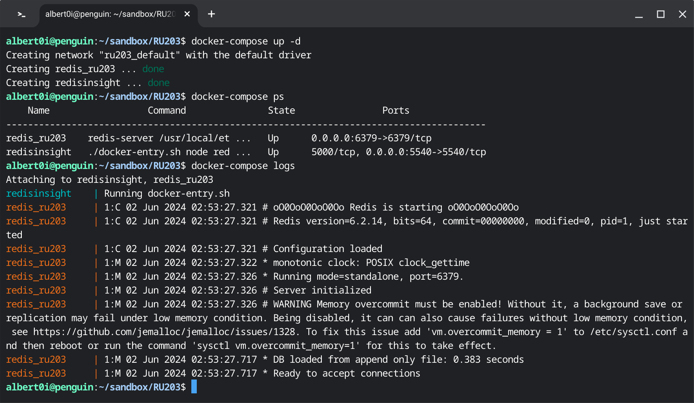

### [The Road So Far](https://youtu.be/FD5VUPwJ9-0)

### Prologue 
I'm not a mindful person. Treasure I kept, notes I pent are lost forthwith. I tried to learn as much as possible, but the more I learn the more I forget. And yet, I keep on learning everyday... For the more I know the more I do not... 


### I. Introduction 
Have a grimpse of the definition, [Redis](https://en.wikipedia.org/wiki/Redis) is defined by: 

> in-memory storage, used as a distributed, in-memory key–value database, cache and message broker, with optional durability. Because it holds all data in memory and because of its design, Redis offers low-latency reads and writes, making it particularly suitable for use cases that require a cache. Redis is the most popular NoSQL database, and one of the most popular databases overall.

> Redis can be used as a database, cache, streaming engine, message broker, and more. The following quick start guides will show you how to use Redis for the following specific purposes:

- [Data structure store](https://redis.io/docs/latest/develop/get-started/data-store/)
- [Document database](https://redis.io/docs/latest/develop/get-started/document-database/)
- [Vector database](https://redis.io/docs/latest/develop/get-started/vector-database/)

If you can not see any usefulness of Redis, please stop reading this article. 


### II. Up and running 
Depending on the type of platform, installation differs. 

#### 1. Linux 
[Install Redis on Linux](https://redis.io/docs/latest/operate/oss_and_stack/install/install-redis/install-redis-on-linux/) is straightforward and hassle-free, for Redis is available in most of the linux distribution. More often than not, the only command you need to run is: 
```
sudo apt-get install redis
```

#### 2. Windows  
Using Redis in Windows is awkwardly embarrassing for there is no official Redis binary. However an unofficial [redis-windows](https://github.com/zkteco-home/redis-windows) is available. It can be installed as a service and with [RedisJson](https://redis.io/json/) support. 

The command to run Redis in both platform is: 
```
redis-server /path/to/redis.conf 
```


### III. Docker 
Oftentimes, you opt to run Redis in containers. depending on the type of containers, the image and configuration differ. 

#### 1. Linux container 
Pulling and using official [Redis](https://hub.docker.com/_/redis) is straightforward and very easy. For a variety of version and linux distribution are at one's disposal. 

A single `docker-compose.yml` is sufficient to boost up everything:

docker-compose.yml
```
version: "3"
services:
# Redis 
  redis:
    container_name: redis_ru203
    image: redis/redis-stack-server:6.2.6-v12
    ports:
      - 6379:6379
    restart: unless-stopped    
    volumes:
          - ./conf:/usr/local/etc/redis:ro
          - ./redisdata:/data:rw
    command: ["redis-server", "/usr/local/etc/redis/redis.conf"]

# Redis Insight
  redisinsight:
    image: redis/redisinsight:2.50
    container_name: redisinsight
    ports:
      - 5540:5540
    restart: unless-stopped    
    volumes:
      - ./redisdata:/data:rw
    depends_on:
      - redis 
```
Please note, **Redis Stack = Redis Stack Server + Redis Insight**, which is the best GUI client, I supposed. When all containers are up, just point your browser to http://localhost:5540 to access Redis. 




Or via redis command line: 


#### 2. Windows container 
Having installed [Docker Desktop on Windows](https://docs.docker.com/desktop/install/windows-install/) and switched to using `Windows containers`. A [Redis7.2.4-Homebrew](https://github.com/Albert0i/Redis7.2.4-Homebrew.git) is available in github to describe how to build a customized redis image. Or pull the pre-built image from Docker Hub:  
```
docker image pull albert0i/redis:7.2.4-nanoserver-20H2
```


**Caveat**: Version of base image used to build customized image must match that in running machine, ie. `20J2` in my environment. 


As of this writing, a version of `2.24.2` version of Docker Desktop is employed. 


A `docker-compose.yml` file:

docker-compose.yml
```
version: "3"
services:
  redis:
    build: 
      context: .
    image: 
      ${IMAGE_NAME}:${IMAGE_VERSION}
    container_name:
        redis
    ports:
      - "6379:6379"
    volumes:
      - ${DATA_DIR}:c:\data
```
And in cooperate with `.env` and `Make` file.

.env
```
# image name
IMAGE_NAME=redis

# image version
IMAGE_VERSION=7.2.4-nanoserver-20H2

# data directory
DATA_DIR=C:\redis\data

COMPOSE_CONVERT_WINDOWS_PATHS=0
```

Makefile
```
cnf ?= .env
include $(cnf)
export $(shell sed 's/=.*//' $(cnf))

#
# Main
#
.PHONY: help prune config my-ciapp

help:
	@echo
	@echo "Usage: make TARGET"
	@echo
	@echo "Redis Dockerize project automation helper for Windows version 1.1"
	@echo
	@echo "Targets:"
	@echo "	build		build custom image"
	@echo "	up  		start the server"
	@echo "	down 		stop the server"
	@echo "	ps 		show running containers"
	@echo "	logs		server logs"
	@echo "	config		edit configuration"

#
# build custom image
#
build:
	docker-compose build

#
# start the server
#
up:
	docker-compose up -d --remove-orphans

#
# stop the server
#
down:
	docker-compose down -v

#
# show running containers 
#
ps:
	docker-compose ps

#
# server logs
#
logs:
	docker-compose logs

#
# edit configuration
#
config:
	nano .env
```


### IV. Summary 
### V. Bibliography 
### Epilogue 
### EOF (2024/06/07)


redis:7.2.4-nanoserver-20H2

albert0i/redis
Updated about 1 year ago
Version 3.2.100 on nanoserver (1909)

docker image tag redis:7.2.4-nanoserver-20H2 albert0i/redis:7.2.4-nanoserver-20H2
docker image push albert0i/redis:7.2.4-nanoserver-20H2

Version 7.2.4 on nanoserver (20H2)


docker image pull albert0i/redis:7.2.4-nanoserver-20H2


### Prologue 

### I. Introduction 

### II. Standalone 
redis.conf 
```
# Accept connections on the specified port, default is 6379
port 6379

# all available interfaces
bind * -::*                     

# max number of simultaneous clients
maxclients 10000

# memory size in bytes  
maxmemory 1288490188

# save 3600 1 300 100 60 10000

appendonly yes
appendfilename "appendonly.aof"

# appendfsync always
appendfsync everysec
# appendfsync no
```
[1.5 Initial Tuning](https://redis.io/university/courses/ru301/)
[2.1 Persistence Options in Redis](https://youtu.be/08V8KeXhZY4)

[3.1 Basic Replication](https://youtu.be/-osCdf90tRA)
[3.3 Understanding Sentinels](https://redis.io/university/courses/ru301/)

[4.0 Clustering in Redis](https://youtu.be/jJMJc9QZaoA)

[5.1 Data Points in Redis](https://redis.io/university/courses/ru301/)
[5.3 Identifying Issues](https://redis.io/university/courses/ru301/)

### III. HA with Sentinels 

### IV. HA with charded cluster 

### V. Summary 

### VI. Bibliography 
1. [Running Redis at scale, Redis University](https://redis.io/university/courses/ru301/)
2. [Redis configuration file example](https://redis.io/docs/latest/operate/oss_and_stack/management/config-file/)
3. [Redis Cluster Specification](https://redis-doc-test.readthedocs.io/en/latest/topics/cluster-spec/#overview-of-redis-cluster-main-components)
4. [ioredis](https://github.com/redis/ioredis)
5. [Sentinel client spec](https://redis.io/docs/latest/develop/reference/sentinel-clients/)
6. [Scale with Redis Cluster](https://redis.io/docs/latest/operate/oss_and_stack/management/scaling/)
7. [redis-windows](https://github.com/zkteco-home/redis-windows)
8. [RedisJson](https://github.com/zkteco-home/RedisJson)
9. [Hash Slot Resharding and Rebalancing for Redis Cluster](https://severalnines.com/blog/hash-slot-resharding-and-rebalancing-redis-cluster/)
10. [Christabel, BY SAMUEL TAYLOR COLERIDGE](https://www.poetryfoundation.org/poems/43971/christabel)


### Epilogue 

### EOF (2024/05/31)


### [The Road So Far](https://youtu.be/FD5VUPwJ9-0)
### Prologue 
### Introduction 
### Up and running 
#### Linux 
#### Windows  
### Docker 
#### Linux container 
#### Windows container 
### Summary 
### Bibliography 
### Epilogue 
### EOF 

### On Topology 
### Prologue 
### Introduction 
### Replications
#### Basic Replication 
#### Replication with Sentinels 
### Sharded cluster 
### Summary 
### Bibliography 
### Epilogue 
### EOF 

### On Topology (cont) 
### Prologue 
### Introduction 
### Replication with sentinels 
### Sharded cluster 
### Summary 
### Bibliography 
### Epilogue 
### EOF 
