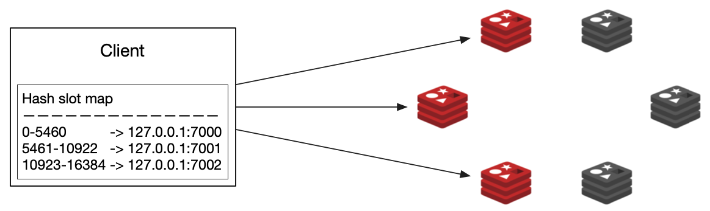
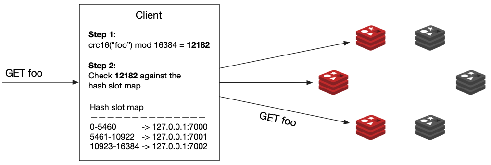

### On Topology

### Prologue 
This article is created from transscript of [RU301](https://redis.io/university/courses/ru301/) verbatim, not because of my laziness. But for the great significance and unstirrable value in the aforementioned narrative of the course. Nevertheless links and addenda will be appended whenever it is appropriate. 


### I. Introduction to High Availability
High availability is a computing concept describing systems that guarantee a high level of uptime: designed to be fault tolerant, highly dependable, operating continuously without intervention, and without a single point of failure.

What does this mean for Redis, specifically? Well, it means that if your primary Redis server fails, a backup will kick in, and you, as a user, will see little to no disruption in the service. 

There are two components needed for this to be possible, *replication* and *automatic failover*. Replication is a continuous copying of data from a primary database to a backup, or a replica database. The two databases are usually located on different physical servers, so that we can have a functional copy of our data in case we lose a server where our primary database sits. But having a backup of our data is not enough for high availability. We also have to have a mechanism that will automatically kick in and redirect all requests toward the replica in the event that the primary fails. This mechanism is called, *automatic failover*.


### II. Basic Replication
Replication in Redis follows a simple primary replica model where the replication happens in one direction, from the primary to one or multiple replicas. Data is only written to the primary instance, and replicas are kept in sync so that they are exact copies of the primaries.

To create a replica, you instantiate a Redis server instance with the configuration directive
of `replicaof` set to the address and port of the primary instance. Once the replica instance is up and running, the replica will try to sync with the primary. To transfer all of its data as efficiently as possible, 

1. the primary instance will produce a compacted version of the data as a snapshot in an RDB file and send it to the replica. The replica will then read the snapshot file and load all of its data into memory, which will bring it to the same state the primary instance had at the moment of creating the RDB file. 
2. When the loading stage is done, the primary instance will send the backlog of any write commands run since the snapshot was made.
3. Finally, the primary instance will send the replica a live stream of all subsequent commands. 

By default, replication is asynchronous. This means that if you send a write command to Redis, you will receive your acknowledged response first, and only then will the command be replicated to the replica. If the primary goes down after acknowledging a write but before the write can be replicated, then you might have data loss.

To avoid this, the client can use the [WAIT](https://redis.io/docs/latest/commands/wait/) command. This command blocks the current client until all the previous write commands are successfully transferred and acknowledged by at least some specified number of replicas. For example, if we send the command `WAIT 2 0`, the client will block or not return a response to the client until all the previous write commands issued on that connection have been written to at least two replicas. The second argument, 0, will instruct the server to block indefinitely. But we can set it to a number in milliseconds, so that it times out after a while and returns the number of replicas that successfully acknowledged the commands. 

Replicas are *read only*. This means that you can configure your clients to read from them, but you cannot write data to them. If you need additional read throughput, you can configure your Redis client to read from replicas as well as from your primary node. However, it's often easier just to scale out your cluster. This lets you scale reads and writes without writing any complex client logic. 

Also, you should know about active active, an advanced feature of Redis Enterprise and Redis Cloud. Active active replicates entire databases across geographically distributed clusters. With active active, you can write locally to any replica databases, and those writes will be reflected globally. Something to keep in mind when you're scaling out.


### III. Enabling Basic Replication
#### Step 1
First let’s create and configure the primary instance. We’ll start with a few configuration changes in its `primary.conf` configuration file.
```
$ touch primary.conf  # Create the configuration file
```

Now open the `primary.conf` file with your favourite text editor and set the following configuration directives:
```
# Create a strong password here
requirepass 123456

# AUTH password of the primary instance in case this instance becomes a replica
masterauth 123456

# Enable AOF file persistence
appendonly yes

# Choose a name for the AOF file
appendfilename "primary.aof"
```

Finally, let’s start the primary instance:
```
$ redis-server ./primary.conf
```

#### Step 2
Next, let’s prepare the configuration file for the replica:
```
$ touch replica.conf
```

Let’s add some settings to the file we just created:
```
# Port on which the replica should run
port 6380

# Address of the primary instance
replicaof 127.0.0.1 6379

# AUTH password of the primary instance
masterauth 123456

# AUTH password for the replica instance
requirepass 123456
```

And let’s start the replica:
```
$ redis-server ./replica.conf
```

#### Step 3
Open two terminal tabs and use them to start connections to the primary and replica instances:
```
# Tab 1 (primary)
$ redis-cli 
```

```
# Tab 2 (replica)
$ redis-cli -p 6380
```

Authenticate on both tabs by running the command AUTH followed by your password:
```
AUTH 123456
```

On the second (replica) tab run the `MONITOR` command which will allow you to see every command executed against that instance.

Go back to the first (primary) tab and execute any write command, for example
```
127.0.0.1:6379> SET foo bar
```

In the second tab you should see that the command was already sent to the replica:
```
1617230062.389077 [0 127.0.0.1:6379] "SELECT" "0"
1617230062.389092 [0 127.0.0.1:6379] "set" "foo" "bar"
```

#### Step 4
Keep the instances running, or at least their configuration files around. We’ll need them for the next section.


### IV. Understanding Sentinels
In the beginning of this article, we learned that we can’t have high availability without replication and automatic failover. We covered replication in the previous two sections, and now we’ll explain Sentinel - a tool that provides the automatic failover.

Redis Sentinel is a distributed system consisting of multiple Redis instances started in sentinel mode. We call these instances **Sentinels**.

The group of Sentinels monitors a primary Redis instance and its replicas. If the sentinels detect that the primary instance has failed, the sentinel processes will look for the replica that has the latest data and will promote that replica to be the new primary. This way, the clients talking to the database will be able to reconnect to the new primary and continue functioning as usual, with minimal disruption to the users.


#### Deciding that a primary instance is down
In order for the Sentinels to be able to decide that a primary instance is down we need to have enough Sentinels agree that the server is unreachable from their point of view.

Having a number of Sentinels agreeing that they need to take an action is called **reaching a quorum**. If the Sentinels can’t reach quorum, they cannot decide that the primary has failed. The exact number of Sentinels needed for quorum is configurable.

#### Triggering a failover
Once the Sentinels have decided that a primary instance is down, they need to elect and authorize a leader (a Sentinel instance) that will do the failover. A leader can only be chosen if the majority of the Sentinels agree on it.

In the final step, the leader will reconfigure the chosen replica to become a primary by sending the command `REPLICAOF NO ONE` and it will reconfigure the other replicas to follow the newly promoted primary.

#### Sentinel and Client Libraries
If you have a system that uses Sentinel for high availability, then you need to have a client that supports Sentinel. Not all libraries have this feature, but most of the popular ones do, so make sure you add it to your list of requirements when choosing your library.


**Addendum**

The group of Sentinels monitors a primary Redis instance and its replicas. If the sentinels detect that the primary instance has failed, the sentinel processes will look for the replica that has the *latest* data and will promote that replica to be the new primary. This way, the clients talking to the database will be able to reconnect to the new primary and continue functioning as usual, with minimal disruption to the users.


### V. Replication with Sentinels 
#### Step 1
If you still have the primary and replica instances we set up in the previous section - great! We’ll reuse them to create our Sentinel setup. If not - refer back to the instructions and go through them again.

When done, you will have a primary Redis instance with one replica.

#### Step 2
To initialise a Redis Sentinel, you need to provide a configuration file, so let’s go ahead and create one:
```
$ touch sentinel1.conf
```

Open the file and paste in the following settings:
```
port 5000
sentinel monitor myprimary 127.0.0.1 6379 2
sentinel down-after-milliseconds myprimary 5000
sentinel failover-timeout myprimary 60000
sentinel auth-pass myprimary 123456
```

Breakdown of terms:

- port - The port on which the Sentinel should run
- sentinel monitor - monitor the Primary on a specific IP address and port. Having the address of the Primary the Sentinels will be able to discover all the replicas on their own. The last argument on this line is the number of Sentinels needed for quorum. In our example - the number is 2.
- sentinel down-after-milliseconds - how many milliseconds should an instance be unreachable so that it’s considered down
- sentinel failover-timeout - if a Sentinel voted another Sentinel for the failover of a given master, it will wait this many milliseconds to try to failover the same master again.
- sentinel auth-pass - In order for Sentinels to connect to Redis server instances when they are configured with requirepass, the Sentinel configuration must include the sentinel auth-pass directive.

#### Step 3
Make two more copies of this file - `sentinel2.conf` and `sentinel3.conf` and edit them so that the PORT configuration is set to 5001 and 5002, respectively.

#### Step 4
Let’s initialise the three Sentinels in three different terminal tabs:
```
# Tab 1
$ redis-server ./sentinel1.conf --sentinel

# Tab 2
$ redis-server ./sentinel2.conf --sentinel

# Tab3
$ redis-server ./sentinel3.conf --sentinel
```

#### Step 5
If you connected to one of the Sentinels now you would be able to run many new commands that would give an error if run on a Redis instance. For example:
```
# Provides information about the Primary
SENTINEL master myprimary

# Gives you information about the replicas connected to the Primary
SENTINEL replicas myprimary

# Provides information on the other Sentinels
SENTINEL sentinels myprimary

# Provides the IP address of the current Primary
SENTINEL get-master-addr-by-name myprimary
```

#### Step 6
If we killed the primary Redis instance now by pressing Ctrl+C or by running the `redis-cli -p 6379 DEBUG sleep 30` command, we’ll be able to observe in the Sentinels’ logs that the failover process will start in about 5 seconds. If you run the command that returns the IP address of the Primary again you will see that the replica has been promoted to a Primary:
```
redis> SENTINEL get-master-addr-by-name myprimary
1) "127.0.0.1"
2) "6380"
```


### VI. Clustering In Redis 
Before we jump into the details, let's first address the elephant in the room. *DBAAS* offerings, or Database as a Service in the cloud. No doubt it's useful to know how Redis scales and how you might deploy it. But deploying and maintaining a Redis cluster is a fair amount of work.

So if you don't want to deploy and manage Redis yourself, then consider sir signing up for Redis Cloud, our managed service, and let us do the scaling for you. Of course, that route is not for everyone. And as I said, there's a lot to learn here. So let's dive in. We'll, start with scalability. Here's one definition.

> Scalability is the property of a system to handle a growing amount of work by adding resources to the system.

The two most common scaling strategies are *vertical scaling* and *horizontal scaling*. Vertical scaling, or also called scaling up, means adding more resources like CPUs or memory to your server. Horizontal scaling, or scaling out, implies adding more servers to your pool of resources. It's the difference between just getting a bigger server and deploying a whole fleet of servers.

Let's take an example. Suppose you have a server with 128 gigabytes of RAM, but you know that your database will need to store 300 gigabytes of data. In this case, you'll have two choices. You can either add more RAM to your server so it can fit the 300 gigabyte data set, or you can add two more servers and split the 300 gigabytes of data between the three of them.

Hitting your server's RAM limit is one reason you might want to scale up or out. But reaching the performance limits in terms of throughput or operations per second is another. Since Redis is mostly single-threaded, a single Redis Server instance cannot make use of the multiple cores of your server's CPU for command processing. But if we split the data between two Redis instances, our system can process requests in parallel, effectively doubling the throughput.

In fact, performance will scale close to linearly by adding more Redis instances to the system. This pattern of splitting data between multiple servers for the purpose of scaling is called *sharding*. The resulting servers or processes that hold chunks of the data are called **shards**. This performance increase sounds amazing,but it adds some complexity. If we divide and distribute our data across two shards, which are just two Redis Server instances, how will we know where to look for each key?

We need to have a way to consistently map a key to a specific shard. There are multiple ways to do this. And different databases adapt different strategies. The one Redis uses is called *algorithmic sharding*. And this is how it works. Define the shard for a given key. We hash the key and then mod the result by the total number of shards. Because we're using a deterministic hash function, this function will always assign a given key to the same shards. 

But what happens if we want to increase our shards count even further, a process commonly called *resharding*? Let's say we add one new shard so that our total number of shards is three. Now, when a client tries to read the key `foo`, they will run the hash function and mod the number of shards as before. This time, the number of shards is different and we're modding with three instead of two. Understandably, the result may be different, pointing us to the wrong shard.

Resharding is a common issue with the algorithmic sharding strategy. This can be solved by rehashing all the keys in the keys base and moving them to the shard appropriate to the new shard count. This is not a trivial task, though. And it can require a lot of time and resources, during which the database will not be able to reach its full performance or might even become unavailable. Redis uses a clever approach to solve this problem-- a logical unit that sits between a key and a shard called a *hashslot*. 

The total number of hashslots in a database is always 16,384, or 16K. The hashslots are divided roughly even across the shards. So, for example, slots 0 through 8,000 might be assigned to shard 1, and slots 8,001 to 16,384 might be assigned to shard 2. In a Redis cluster, we actually mod by the number of hashslots, not by the number of shards. Each key is assigned to a hashslot. When we do need to reshard, we simply move hashslots from one shard to another, distributing the data as required across the different Redis instances. 

Now that we know what sharding is and how it works in a Redis cluster, we can move on to high availability. Redis cluster is what provides sharding and high availability in open source Redis. High availability refers to the cluster's ability to remain operational even in the face of certain failures. For example, the cluster can detect when a primary shard fails and promote a replica to a primary without any manual intervention from the outside. But how does it do it? How does it that a primary shard has failed? And how does it promote its replica to the new primary? Say we have one replica for every primary shard.

If all our data is divided between three Redis Servers, we would need a six-membered cluster, with three primary shards and three replicas. All six shards are connected to each other over TCP and constantly ping each other and exchange messages. These messages allow the cluster to determine which shards are alive. When enough shards report that a given primary shard is not responding to them, they can agree to trigger a fail-over and promote the shard's replica to become the new primary. 

How many shards need to agree that a fellow shard is offline before fail-over is triggered? Well that's configurable. And you could set it up when you create a cluster. But there are some very important guidelines that you need to follow. To prevent something called a *split brain* situation in a Redis cluster, always keep an odd number of primary shards and two replicas per primary shard. Split brain situation is a very common issue in the world of distributed systems. A popular solution is to always keep an odd number of shards in your cluster. Again, to prevent this kind of conflict, always keep the odd number of primary shards and two replicas per primary shard.

**Addendum**

Sharding, in a way, resembles [Partitioning](https://dev.mysql.com/doc/refman/8.0/en/partitioning-overview.html) in Relational Database. 

> The SQL standard does not provide much in the way of guidance regarding the physical aspects of data storage. The SQL language itself is intended to work independently of any data structures or media underlying the schemas, tables, rows, or columns with which it works. Nonetheless, most advanced database management systems have evolved some means of determining the physical location to be used for storing specific pieces of data in terms of the file system, hardware or even both. In MySQL, the InnoDB storage engine has long supported the notion of a tablespace, and the MySQL Server, even prior to the introduction of partitioning, could be configured to employ different physical directories for storing different databases.

> Partitioning takes this notion a step further, by enabling you to distribute portions of individual tables across a file system according to rules which you can set largely as needed. In effect, different portions of a table are stored as separate tables in different locations. The user-selected rule by which the division of data is accomplished is known as a partitioning function, which in MySQL can be the modulus, simple matching against a set of ranges or value lists, an internal hashing function, or a linear hashing function. The function is selected according to the partitioning type specified by the user, and takes as its parameter the value of a user-supplied expression. This expression can be a column value, a function acting on one or more column values, or a set of one or more column values, depending on the type of partitioning that is used.

> This is known as horizontal partitioning—that is, different rows of a table may be assigned to different physical partitions. MySQL 8.0 does not support vertical partitioning, in which different columns of a table are assigned to different physical partitions. There are no plans at this time to introduce vertical partitioning into MySQL.

> In MySQL 8.0, the only storage engines that support partitioning are InnoDB and NDB. Partitioning cannot be used with storage engines that do not support it; these include the MyISAM, MERGE, CSV, and FEDERATED storage engines.


### VII. Creating a Redis Cluster
#### Step 1
To create a cluster, we need to spin up a few empty Redis instances and configure them to run in cluster mode.

Here’s a minimal configuration file for Redis Cluster:
```
# redis.conf file
port 7000
cluster-enabled yes
cluster-config-file nodes.conf
cluster-node-timeout 5000
appendonly yes
```

On the first line we specify the port on which the server should run, then we state that we want the server to run in cluster mode, with the `cluster-enabled yes` directive. `cluster-config-file` defines the name of the file where the configuration for this node is stored, in case of a server restart. Finally, `cluster-node-timeout` is the number of milliseconds a node must be unreachable for it to be considered in failure state.

#### Step 2
Let’s create a cluster on your localhost with three primary shards and three replicas (remember, in production always use two replicas to protect against a split-brain situation). We’ll need to bring up six Redis processes and create a `redis.conf` file for each of them, specifying their port and the rest of the configuration directives above.

First, create six directories:
```
mkdir 7000 7001 7002 7003 7004 7005
```

#### Step 3
Then create the minimal configuration redis.conf file from above in each one of them, making sure you change the port directive to match the directory name. You should end up with the following directory structure:

- 7000
  - redis.conf
- 7001
  - redis.conf
- 7002
  - redis.conf
- 7003
  - redis.conf
- 7004
  - redis.conf
- 7005
  - redis.conf

#### Step 4
Open six terminal tabs and start the servers by going into each one of the directories and starting a Redis instance:
```
# Terminal tab 1
cd 7000
/path/to/redis-server ./redis.conf
# Terminal tab 2
cd 7001
/path/to/redis-server ./redis.conf
```
... and so on.

#### Step 5
Now that you have six empty Redis servers running, you can join them in a cluster:
```
redis-cli --cluster create 127.0.0.1:7000 127.0.0.1:7001 \
127.0.0.1:7002 127.0.0.1:7003 127.0.0.1:7004 127.0.0.1:7005 \
--cluster-replicas 1
```

Here we list the ports and IP addresses of all six servers and use the `CREATE` command to instruct Redis to join them in a cluster, creating one replica for each primary. Redis-cli will propose a configuration; accept it by typing yes. The cluster will be configured and joined, which means, instances will be bootstrapped into talking with each other.

Finally, you should see a message saying:
```
[OK] All 16384 slots covered
```

This means that there is at least a master instance serving each of the 16384 slots available.

#### Step 6
Let’s add a new shard to the cluster, which is something you might do when you need to scale.

First, as before, we need to start two new empty Redis instances (primary and its replica) in cluster mode. We create new directories 7006 and 7007 and in them we copy the same `redis.conf` file we used before, making sure we change the port directive in them to the appropriate port (7006 and 7007).
```
$ mkdir 7006 7007
$ cp 7000/redis.conf 7006/redis.conf
$ cp 7000/redis.conf 7007/redis.conf
```

Update the port numbers in the files ./7006/redis.conf and ./7007/redis.conf to 7006 and 7007, respectively.

#### Step 7
Let’s start the Redis instances:
```
# Terminal tab 7
$ cd 7006
$ redis-server ./redis.conf
# Terminal tab 8
$ cd 7007
$ redis-server ./redis.conf
```

#### Step 8
In the next step we join the new primary shard to the cluster with the add-node command. The first parameter is the address of the new shard, and the second parameter is the address of any of the current shards in the cluster.
```
redis-cli --cluster add-node 127.0.0.1:7006 127.0.0.1:7000
```

Note: The Redis commands use the term “Nodes” for what we call “Shards” in this training, so a command named “add-node” would mean “add a shard”.

#### Step 9
Finally we need to join the new replica shard, with the same add-node command, and a few extra arguments indicating the shard is joining as a replica and what will be its primary shard. If we don’t specify a primary shard Redis will assign one itself.

We can find the IDs of our shards by running the cluster nodes command on any of the shards:
```
$ redis-cli -p 7000 cluster nodes
46a768cfeadb9d2aee91ddd882433a1798f53271 127.0.0.1:7006@17006 master - 0 1616754504000 0 connected
1f2bc068c7ccc9e408161bd51b695a9a47b890b2 127.0.0.1:7003@17003 slave a138f48fe038b93ea2e186e7a5962fb1fa6e34fa 0 1616754504551 3 connected
5b4e4be56158cf6103ffa3035024a8d820337973 127.0.0.1:7001@17001 master - 0 1616754505584 2 connected 5461-10922
a138f48fe038b93ea2e186e7a5962fb1fa6e34fa 127.0.0.1:7002@17002 master - 0 1616754505000 3 connected 10923-16383
71e078dab649166dcbbcec51520742bc7a5c1992 127.0.0.1:7005@17005 slave 5b4e4be56158cf6103ffa3035024a8d820337973 0 1616754505584 2 connected
f224ecabedf39d1fffb34fb6c1683f8252f3b7dc 127.0.0.1:7000@17000 myself,master - 0 1616754502000 1 connected 0-5460
04d71d5eb200353713da475c5c4f0a4253295aa4 127.0.0.1:7004@17004 slave f224ecabedf39d1fffb34fb6c1683f8252f3b7dc 0 1616754505896 1 connected
```

The port of the primary shard we added in the last step was 7006, and we can see it on the first line. It’s id is 46a768cfeadb9d2aee91ddd882433a1798f53271.

The resulting command is:
```
$ redis-cli -p 7000 --cluster add-node 127.0.0.1:7007 127.0.0.1:7000 --cluster-slave --cluster-master-id 46a768cfeadb9d2aee91ddd882433a1798f53271
```

The flag `cluster-slave` indicates that the shard should join as a replica and `--cluster-master-id` 46a768cfeadb9d2aee91ddd882433a1798f53271 specifies which primary shard it should replicate.

#### Step 10
Now our cluster has eight shards (four primary and four replica), but if we run the cluster slots command we’ll see that the newly added shards don’t host any hash slots, and thus - data. Let’s assign some hash slots to them:
```
$ redis-cli  -p 7000  --cluster reshard 127.0.0.1:7000
```

We use the command reshard and the address of any shard in the cluster as an argument here. In the next step we’ll be able to choose the shards we’ll be moving slots from and to.

The first question you’ll get is about the number of slots you want to move. If we have 16384 slots in total, and four primary shards, let’s get a quarter of all shards, so the data is distributed equally. 16384 ÷ 4 is 4096, so let’s use that number.

The next question is about the receiving shard id; the ID of the primary shard we want to move the data to, which we learned how to get in the previous step, with the cluster nodes command.

Finally, we need to enter the IDs of the shards we want to copy data from. Alternatively, we can type “all” and the shard will move a number of hash slots from all available primary shards.
```
$ redis-cli -p 7000 --cluster reshard 127.0.0.1:7000
....
....
....
How many slots do you want to move (from 1 to 16384)? 4096
What is the receiving node ID? 46a768cfeadb9d2aee91ddd882433a1798f53271
Please enter all the source node IDs.
  Type 'all' to use all the nodes as source nodes for the hash slots.
  Type 'done' once you entered all the source nodes IDs.
Source node #1: all

Ready to move 4096 slots.
  Source nodes:
	M: f224ecabedf39d1fffb34fb6c1683f8252f3b7dc 127.0.0.1:7000
   	slots:[0-5460] (5461 slots) master
   	1 additional replica(s)
	M: 5b4e4be56158cf6103ffa3035024a8d820337973 127.0.0.1:7001
   	slots:[5461-10922] (5462 slots) master
   	1 additional replica(s)
	M: a138f48fe038b93ea2e186e7a5962fb1fa6e34fa 127.0.0.1:7002
   	slots:[10923-16383] (5461 slots) master
   	1 additional replica(s)
  Destination node:
	M: 46a768cfeadb9d2aee91ddd882433a1798f53271 127.0.0.1:7006
   	slots: (0 slots) master
   	1 additional replica(s)
  Resharding plan:
	Moving slot 5461 from 5b4e4be56158cf6103ffa3035024a8d820337973
	Moving slot 5462 from 5b4e4be56158cf6103ffa3035024a8d820337973

Do you want to proceed with the proposed reshard plan (yes/no)? 
Moving slot 5461 from 127.0.0.1:7001 to 127.0.0.1:7006:
Moving slot 5462 from 127.0.0.1:7001 to 127.0.0.1:7006:
Moving slot 5463 from 127.0.0.1:7001 to 127.0.0.1:7006:
....
....
....
```

Once the command finishes we can run the cluster slots command again and we’ll see that our new primary and replica shards have been assigned some hash slots:
```
$ redis-cli -p 7000 cluster slots
```


### VIII. Using Redis-CLI with a Redis Cluster
When you use redis-cli to connect to a shard of a Redis Cluster, you are connected to that shard only, and cannot access data from other shards. If you try to access keys from the wrong shard, you will get a MOVED error.

There is a trick you can use with redis-cli so you don’t have to open connections to all the shards, but instead you let it do the connect and reconnect work for you. It’s the redis-cli cluster support mode, triggered by the -c switch:
```
$ redis-cli -p 7000 -c
```
When in cluster mode, if the client gets an (error) MOVED 15495 127.0.0.1:7002 error response from the shard it’s connected to, it will simply reconnect to the address returned in the error response, in this case 127.0.0.1:7002.

Now it’s your turn: use redis-cli cluster mode to connect to your cluster and try accessing keys in different shards. Observe the response messages.

### IX. Redis Cluster and Client Libraries
To use a client library with Redis Cluster, the client libraries need to be cluster-aware. Clients that support Redis Cluster typically feature a special connection module for managing connections to the cluster. The process that some of the better client libraries follow usually goes like this:

The client connects to any shard in the cluster and gets the addresses of the rest of the shards. The client also fetches a mapping of hash slots to shards so it can know where to look for a key in a specific hash slot. This hash slot map is cached locally.



When the client needs to read/write a key, it first runs the hashing function (crc16) on the key name and then modulo divides by 16384, which results in the key’s hash slot number.

In the example below the hash slot number for the key “foo” is 12182. Then the client checks the hash slot number against the hash slot map to determine which shard it should connect to. In our example, the hash slot number 12182 lives on shard 127.0.0.1:7002.

Finally, the client connects to the shard and finds the key it needs to work with.



If the topology of the cluster changes for any reason and the key has been moved, the shard will respond with an (error) MOVED 15495 127.0.0.1:7006 error, returning the address of the new shard responsible for that key. This indicates to the client that it needs to re-query the cluster for its topology and hash slot allocation, so it will do that and update its local hash slot map for future queries.

Not every client library has this extra logic built in, so when choosing a client library, make sure to look for ones with cluster support.

Another detail to check is if the client stores the hash slot map locally. If it doesn’t, and it relies on the (error) MOVED response to get the address of the right shard, you can expect to have a much higher latency than usual because your client may have to make two network requests instead of one for a big part of the requests.


### X. Summary 
As I have said: "Scaling only happens when certain system limits, ie. CPU, RAM, network bandwidth are reached in a single instance setting". If your system makes heavy usage on read, but relatively few on write, consider adding one or more replicas. If your system makes heavy usage on both read and write, clustering is the obviously choice. As topology evolves, more resource has to be dedicated in day-to-day life. 


### XI. Bibliography 
1. [Running Redis at scale, Redis University](https://redis.io/university/courses/ru301/)
2. [Redis configuration file example](https://redis.io/docs/latest/operate/oss_and_stack/management/config-file/)
3. [Redis replication](https://redis.io/docs/latest/operate/oss_and_stack/management/replication/)
4. [Sentinel client spec](https://redis.io/docs/latest/develop/reference/sentinel-clients/)
5. [Scale with Redis Cluster](https://redis.io/docs/latest/operate/oss_and_stack/management/scaling/)
6. [Redis Cluster Specification](https://redis-doc-test.readthedocs.io/en/latest/topics/cluster-spec/#overview-of-redis-cluster-main-components)
7. [Hash Slot Resharding and Rebalancing for Redis Cluster](https://severalnines.com/blog/hash-slot-resharding-and-rebalancing-redis-cluster/)
8. [Node-Redis](https://www.npmjs.com/package/redis)
9. [ioredis](https://www.npmjs.com/package/ioredis)
10. [Christabel, BY SAMUEL TAYLOR COLERIDGE](https://www.poetryfoundation.org/poems/43971/christabel)


### Epilogue 
Time and money are two major factors which drive people forward. Oftentimes one either loses time or money and vice versa. On a sunny day, when a field trip is ruined by a broken car right in the way, what will you lose? It's your temper... 


### EOF (2024/06/07)