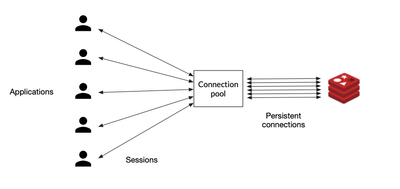

### On Topology

### Prologue 
This article is created from transscript of [RU301](https://redis.io/university/courses/ru301/) verbatim, not because of my laziness. But for the great significance and unstirrable value in the aforementioned narrative of the course. Nevertheless links and addenda will be appended whenever it is appropriate. 


### I. Introduction to High Availability
High availability is a computing concept describing systems that guarantee a high level of uptime: designed to be fault tolerant, highly dependable, operating continuously without intervention, and without a single point of failure.

What does this mean for Redis, specifically? Well, it means that if your primary Redis server fails, a backup will kick in, and you, as a user, will see little to no disruption in the service. 

There are two components needed for this to be possible, *replication* and *automatic failover*. Replication is a continuous copying of data from a primary database to a backup, or a replica database. The two databases are usually located on different physical servers, so that we can have a functional copy of our data in case we lose a server where our primary database sits. But having a backup of our data is not enough for high availability. We also have to have a mechanism that will automatically kick in and redirect all requests toward the replica in the event that the primary fails. This mechanism is called, *automatic failover*.


### II. Basic Replication
Replication in Redis follows a simple primary replica model where the replication happens in one direction, from the primary to one or multiple replicas. Data is only written to the primary instance, and replicas are kept in sync so that they are exact copies of the primaries.

To create a replica, you instantiate a Redis server instance with the configuration directive
of `replicaof` set to the address and port of the primary instance. Once the replica instance is up and running, the replica will try to sync with the primary. To transfer all of its data as efficiently as possible, 

1. the primary instance will produce a compacted version of the data as a snapshot in an RDB file and send it to the replica. The replica will then read the snapshot file and load all of its data into memory, which will bring it to the same state the primary instance had at the moment of creating the RDB file. 
2. When the loading stage is done, the primary instance will send the backlog of any write commands run since the snapshot was made.
3. Finally, the primary instance will send the replica a live stream of all subsequent commands. 

By default, replication is asynchronous. This means that if you send a write command to Redis, you will receive your acknowledged response first, and only then will the command be replicated to the replica. If the primary goes down after acknowledging a write but before the write can be replicated, then you might have data loss.

To avoid this, the client can use the [WAIT](https://redis.io/docs/latest/commands/wait/) command. This command blocks the current client until all the previous write commands are successfully transferred and acknowledged by at least some specified number of replicas. For example, if we send the command `WAIT 2 0`, the client will block or not return a response to the client until all the previous write commands issued on that connection have been written to at least two replicas. The second argument, 0, will instruct the server to block indefinitely. But we can set it to a number in milliseconds, so that it times out after a while and returns the number of replicas that successfully acknowledged the commands. 

Replicas are *read only*. This means that you can configure your clients to read from them, but you cannot write data to them. If you need additional read throughput, you can configure your Redis client to read from replicas as well as from your primary node. However, it's often easier just to scale out your cluster. This lets you scale reads and writes without writing any complex client logic. 

Also, you should know about active active, an advanced feature of Redis Enterprise and Redis Cloud. Active active replicates entire databases across geographically distributed clusters. With active active, you can write locally to any replica databases, and those writes will be reflected globally. Something to keep in mind when you're scaling out.


### III. Enabling Basic Replication
#### Step 1
First let’s create and configure the primary instance. We’ll start with a few configuration changes in its `primary.conf` configuration file.
```
$ touch primary.conf  # Create the configuration file
```

Now open the `primary.conf` file with your favourite text editor and set the following configuration directives:
```
# Create a strong password here
requirepass a_strong_password

# AUTH password of the primary instance in case this instance becomes a replica
masterauth a_strong_password

# Enable AOF file persistence
appendonly yes

# Choose a name for the AOF file
appendfilename "primary.aof"
```

Finally, let’s start the primary instance:
```
$ redis-server ./primary.conf
```

#### Step 2
Next, let’s prepare the configuration file for the replica:
```
$ touch replica.conf
```

Let’s add some settings to the file we just created:
```
# Port on which the replica should run
port 6380

# Address of the primary instance
replicaof 127.0.0.1 6379

# AUTH password of the primary instance
masterauth a_strong_password

# AUTH password for the replica instance
requirepass a_strong_password
```

And let’s start the replica:
```
$ redis-server ./replica.conf
```

#### Step 3
Open two terminal tabs and use them to start connections to the primary and replica instances:
```
# Tab 1 (primary)
$ redis-cli 
```

```
# Tab 2 (replica)
$ redis-cli -p 6380
```

Authenticate on both tabs by running the command AUTH followed by your password:
```
AUTH a_strong_password
```

On the second (replica) tab run the `MONITOR` command which will allow you to see every command executed against that instance.

Go back to the first (primary) tab and execute any write command, for example
```
127.0.0.1:6379> SET foo bar
```

In the second tab you should see that the command was already sent to the replica:
```
1617230062.389077 [0 127.0.0.1:6379] "SELECT" "0"
1617230062.389092 [0 127.0.0.1:6379] "set" "foo" "bar"
```

#### Step 4
Keep the instances running, or at least their configuration files around. We’ll need them for the next exercise.


### IV. Redis Clients
Redis has a client-server architecture and uses a request-response model. Applications send requests to the Redis server, which processes them and returns responses for each. 

The role of a Redis client library is to act as an intermediary between your application and the Redis server. Client libraries perform the following duties, implement the Redis wire protocol, the format used to send requests and receive responses from the Redis server, provide an idiomatic API for using Redis commands from a particular programming language, and managing the connection to Redis. Redis clients communicate with the Redis server over TCP using a protocol called RESP, Redis Serialization Protocol, designed specifically for Redis. The [RESP](https://redis.io/docs/latest/develop/reference/protocol-spec/) protocol is simple and text based, so it is easily read by humans as well as machines. 

**Addendum**

In javascript programming, there are two popular client libraries, ie: [Node-Redis](https://www.npmjs.com/package/redis) and [ioredis](https://www.npmjs.com/package/ioredis). Node-Redis has been around for a longer time and has a large user base, making it a mature and well-tested library and has an active community that provides support and contributes to its ongoing development. ioredis is a relatively newer library compared to Node-Redis, which means it may have a smaller user base and potentially fewer community resources, it may have a slightly more limited feature set compared to Node-Redis.

Both of them support Redis Cluster but only ioredis supports replication with Sentinel. 


### V. Client Performance Improvements
#### 1. Connection management - Pooling
As we showed in the previous section, Redis clients are responsible for managing connections to the Redis server. Creating and recreating new connections over and over again, creates a lot of unnecessary load on the server. A good client library will offer some way of optimizing connection management, by setting up a connection pool, for example.

With connection pooling, the client library will instantiate a series of (persistent) connections to the Redis server and keep them open. When the application needs to send a request, the current thread will get one of these connections from the pool, use it, and return it when done.



So if possible, always try to choose a client library that supports pooling connections, because that decision alone can have a huge influence on your system’s performance.

#### 2. Pipelining
As in any client-server application, Redis can handle many clients simultaneously.

Each client does a (typically blocking) read on a socket and waits for the server response. The server reads the request from the socket, parses it, processes it, and writes the response to the socket. The time the data packets take to travel from the client to the server, and then back again, is called network round trip time, or RTT.

If, for example, you needed to execute 50 commands, you would have to send a request and wait for the response 50 times, paying the RTT cost every single time. To tackle this problem, Redis can process new requests even if the client hasn't already read the old responses. This way, you can send multiple commands to the server without waiting for the replies at all; the replies are read in the end, in a single step.


This technique is called pipelining and is another good way to improve the performance of your system. Most Redis libraries support this technique out of the box.


### VI. Initial Tuning
We love Redis because it’s fast (and fun!), so as we begin to consider scaling out Redis, we first want to make sure we've done everything we can to maximize its performance.

Let's start by looking at some important tuning parameters.

`Max Clients`
Redis has a default of max of 10,000 clients; after that maximum has been reached, Redis will respond to all new connections with an error. If you have a lot of connections (or a lot of application instances), then you may need to go higher. You can set the max number of simultaneous clients in the Redis config file:
```
maxclients 20000
```

`Max Memory`
By default, Redis has no max memory limit, so it will use all available system memory. If you are using replication, you will want to limit the memory usage in order to have overhead for replica output buffers. It’s also a good idea to leave memory for the system. Something like 25% overhead. You can update this setting in Redis config file:
```
# memory size in bytes  
maxmemory 1288490188
```

`Set tcp-backlog`
The Redis server uses the value of tcp-backlog to specify the size of the complete connection queue.

Redis passes this configuration as the second parameter of the `listen(int s, int backlog)` call.

If you have many connections, you will need to set this higher than the default of 511. You can update this in Redis config file:
```
# TCP listen() backlog. 
# 
# In high requests-per-second environments you need an high backlog in order 
# to avoid slow clients connections issues. Note that the Linux kernel 
# will silently truncate it to the value of /proc/sys/net/core/somaxconn so 
# make sure to raise both the value of somaxconn and tcp_max_syn_backlog 
# in order to get the desired effect.
tcp-backlog 65536
```
As the comment in `redis.conf` indicates, the value of `somaxconn` and `tcp_max_syn_backlog` may need to be increased at the OS level as well.

`Set read replica configurations`
One simple way to scale Redis is to add read replicas and take load off of the primary. This is most effective when you have a read-heavy (as opposed to write-heavy) workload. You will probably want to have the replica available and still serving stale data, even if the replication is not completed. You can update this in the Redis config:
```
slave-serve-stale-data yes
```
You will also want to prevent any writes from happening on the replicas. You can update this in the Redis config:
```
slave-read-only yes
```

`Kernel memory`
Under high load, occasional performance dips can occur due to memory allocation. This is something Salvatore, the creator of Redis, blogged about in the past. The performance issue is related to transparent hugepages, which you can disable at the OS level if needed.
```
$ echo 'never' > /sys/kernel/mm/transparent_hugepage/enabled
```

`Kernel network stack`
If you plan on handling a large number of connections in a high performance environment, we recommend tuning the following kernel parameters:
```
vm.swappiness=0                       # turn off swapping
net.ipv4.tcp_sack=1                   # enable selective acknowledgements
net.ipv4.tcp_timestamps=1             # needed for selective acknowledgements
net.ipv4.tcp_window_scaling=1         # scale the network window
net.ipv4.tcp_congestion_control=cubic # better congestion algorithm
net.ipv4.tcp_syncookies=1             # enable syn cookies
net.ipv4.tcp_tw_recycle=1             # recycle sockets quickly
net.ipv4.tcp_max_syn_backlog=NUMBER   # backlog setting
net.core.somaxconn=NUMBER             # up the number of connections per port
net.core.rmem_max=NUMBER              # up the receive buffer size
net.core.wmem_max=NUMBER              # up the buffer size for all connections
```

`File descriptor limits`
If you do not set the correct number of file descriptors for the Redis user, you will see errors indicating that “Redis can’t set maximum open files..” You can increase the file descriptor limit at the OS level.

Here's an example on Ubuntu using systemd:
```
/etc/systemd/system/redis.service
[Service] 
... 
User=redis 
Group=redis 
...
LimitNOFILE=65536 
...
```
You will then need to reload the daemon and restart the redis service.

`Enabling RPS (Receive Packet Steering) and CPU preferences`
One way we can improve performance is to prevent Redis from running on the same CPUs as those handling any network traffic. This can be accomplished by enabling RPS for our network interfaces and creating some CPU affinity for our Redis process.

Here is an example. First we can enable RPS on CPUs 0-1:
```
$ echo '3' > /sys/class/net/eth1/queues/rx-0/rps_cpus
```
Then we can set the CPU affinity for redis to CPUs 2-8:
```
# config is set to write pid to /var/run/redis.pid
$ taskset -pc 2-8 `cat /var/run/redis.pid`
pid 8946's current affinity list: 0-8
pid 8946's new affinity list: 2-8
```


### VII. Persistence Options in Redis
If a Redis server that only stores data in RAM is restarted, all data is lost. To prevent such data loss, there needs to be some mechanism for persisting the data to disk. Redis provides two of them, snapshotting and an append-only file, or AOF. You can configure your Redis instance
to use either of the two or a combination of both. 

#### 1. Snapshot 
When a snapshot is created, the entire point in time via the data set is written to persistent storage
in a compact RDB file. You can set up recurring backups,
for example, every one, 12, or 24 hours, and use these backups to easily restore
different versions of the data set in case of disasters. You can also use these snapshots to create a clone of the server or simply leave them in place for a future restart.

Creating an RDB file requires a lot of disk IO. If performed in the main Redis process, this would reduce the server's performance. That's why this work is done by a forked child process.
But even forking can be time consuming if the data set is large. This may result in decreased performance or in Redis failing to serve clients for a few milliseconds or even up to a second for very large data sets. Understanding this should help you decide whether this solution makes sense for your requirements. You can configure the name and location of the RDB file
with the `dbfilename` and `dir` configuration directives, either through the redis.conf file or through the Redis CLI. And of course, you can configure how often you want to create a snapshot.
Here's an excerpt from the `redis.conf `file showing the default values.
```
################################ SNAPSHOTTING  ################################

# Save the DB to disk.
#
# save <seconds> <changes> [<seconds> <changes> ...]
#
# Redis will save the DB if the given number of seconds elapsed and it
# surpassed the given number of write operations against the DB.
#
# Snapshotting can be completely disabled with a single empty string argument
# as in following example:
#
# save ""
#
# Unless specified otherwise, by default Redis will save the DB:
#   * After 3600 seconds (an hour) if at least 1 change was performed
#   * After 300 seconds (5 minutes) if at least 100 changes were performed
#   * After 60 seconds if at least 10000 changes were performed
#
# You can set these explicitly by uncommenting the following line.
#
# save 3600 1 300 100 60 10000

# By default Redis will stop accepting writes if RDB snapshots are enabled
# (at least one save point) and the latest background save failed.
# This will make the user aware (in a hard way) that data is not persisting
# on disk properly, otherwise chances are that no one will notice and some
# disaster will happen.
#
# If the background saving process will start working again Redis will
# automatically allow writes again.
#
# However if you have setup your proper monitoring of the Redis server
# and persistence, you may want to disable this feature so that Redis will
# continue to work as usual even if there are problems with disk,
# permissions, and so forth.
stop-writes-on-bgsave-error yes

# Compress string objects using LZF when dump .rdb databases?
# By default compression is enabled as it's almost always a win.
# If you want to save some CPU in the saving child set it to 'no' but
# the dataset will likely be bigger if you have compressible values or keys.
rdbcompression yes

# Since version 5 of RDB a CRC64 checksum is placed at the end of the file.
# This makes the format more resistant to corruption but there is a performance
# hit to pay (around 10%) when saving and loading RDB files, so you can disable it
# for maximum performances.
#
# RDB files created with checksum disabled have a checksum of zero that will
# tell the loading code to skip the check.
rdbchecksum yes

# Enables or disables full sanitization checks for ziplist and listpack etc when
# loading an RDB or RESTORE payload. This reduces the chances of a assertion or
# crash later on while processing commands.
# Options:
#   no         - Never perform full sanitization
#   yes        - Always perform full sanitization
#   clients    - Perform full sanitization only for user connections.
#                Excludes: RDB files, RESTORE commands received from the master
#                connection, and client connections which have the
#                skip-sanitize-payload ACL flag.
# The default should be 'clients' but since it currently affects cluster
# resharding via MIGRATE, it is temporarily set to 'no' by default.
#
# sanitize-dump-payload no

# The filename where to dump the DB
dbfilename dump.rdb

# Remove RDB files used by replication in instances without persistence
# enabled. By default this option is disabled, however there are environments
# where for regulations or other security concerns, RDB files persisted on
# disk by masters in order to feed replicas, or stored on disk by replicas
# in order to load them for the initial synchronization, should be deleted
# ASAP. Note that this option ONLY WORKS in instances that have both AOF
# and RDB persistence disabled, otherwise is completely ignored.
#
# An alternative (and sometimes better) way to obtain the same effect is
# to use diskless replication on both master and replicas instances. However
# in the case of replicas, diskless is not always an option.
rdb-del-sync-files no

# The working directory.
#
# The DB will be written inside this directory, with the filename specified
# above using the 'dbfilename' configuration directive.
#
# The Append Only File will also be created inside this directory.
#
# Note that you must specify a directory here, not a file name.
dir ./
```
```
SAVE 60 1000 
```
As an example, this configuration will make Redis automatically dump the data set to disk every 60 seconds if at least 1,000 keys changed in that period. While snapshotting it is a great strategy for the use cases explained above, it leaves a huge possibility for data loss. You can configure snapshots to run every few minutes or after X writes against the database. But if the server crashes, you lose all the writes since the last snapshot was taken. In many use cases, that kind of data loss can be acceptable. But in many others, it is absolutely not. For all of the other use cases, 

#### 2. AOF 

Redis offers the AOF persistence option. AOF, or Append Only File, works by logging every incoming write command to disk as it happens. These commands can then be replayed to server startup to reconstruct the original data set. Commands are logged using the same format as the Redis protocol
itself in an append only fashion. 

The AOF approach provides greater durability than snapshotting and allows you to configure how often the syncs happen. Depending on your durability requirements, or how much data you can afford to lose, you can choose which FYSNC policy is best for your use case: 

- FYSNC every write, the safest policy. The write is acknowledged to the client only after it has been written to the AOF file and flushed to disk. Since in this approach, we are writing to disk synchronously, we can expect a much higher latency than usual. 

- FYSNC every second, the default policy. FYSNC is performed asynchronously in a background thread. So write performance is still high. Choose this option if you need high performance and can afford to lose up to one second worth of writes. 

- No FYSNC. In this case, Redis will log the command to the file descriptor but will not force the OS to flush the data to disk. If the OS crashes, we can lose a few seconds of data. Normally, Linux will flush data every 30 seconds with this configuration. But it's up to the kernel's exact tuning. The relevant configuration directives for AOF are shown on the screen.
```
############################## APPEND ONLY MODE ###############################

# By default Redis asynchronously dumps the dataset on disk. This mode is
# good enough in many applications, but an issue with the Redis process or
# a power outage may result into a few minutes of writes lost (depending on
# the configured save points).
#
# The Append Only File is an alternative persistence mode that provides
# much better durability. For instance using the default data fsync policy
# (see later in the config file) Redis can lose just one second of writes in a
# dramatic event like a server power outage, or a single write if something
# wrong with the Redis process itself happens, but the operating system is
# still running correctly.
#
# AOF and RDB persistence can be enabled at the same time without problems.
# If the AOF is enabled on startup Redis will load the AOF, that is the file
# with the better durability guarantees.
#
# Note that changing this value in a config file of an existing database and
# restarting the server can lead to data loss. A conversion needs to be done
# by setting it via CONFIG command on a live server first.
#
# Please check /operate/oss_and_stack/management/persistence for more information.

appendonly no

# The base name of the append only file.
#
# Redis 7 and newer use a set of append-only files to persist the dataset
# and changes applied to it. There are two basic types of files in use:
#
# - Base files, which are a snapshot representing the complete state of the
#   dataset at the time the file was created. Base files can be either in
#   the form of RDB (binary serialized) or AOF (textual commands).
# - Incremental files, which contain additional commands that were applied
#   to the dataset following the previous file.
#
# In addition, manifest files are used to track the files and the order in
# which they were created and should be applied.
#
# Append-only file names are created by Redis following a specific pattern.
# The file name's prefix is based on the 'appendfilename' configuration
# parameter, followed by additional information about the sequence and type.
#
# For example, if appendfilename is set to appendonly.aof, the following file
# names could be derived:
#
# - appendonly.aof.1.base.rdb as a base file.
# - appendonly.aof.1.incr.aof, appendonly.aof.2.incr.aof as incremental files.
# - appendonly.aof.manifest as a manifest file.

appendfilename "appendonly.aof"

# For convenience, Redis stores all persistent append-only files in a dedicated
# directory. The name of the directory is determined by the appenddirname
# configuration parameter.

appenddirname "appendonlydir"

# The fsync() call tells the Operating System to actually write data on disk
# instead of waiting for more data in the output buffer. Some OS will really flush
# data on disk, some other OS will just try to do it ASAP.
#
# Redis supports three different modes:
#
# no: don't fsync, just let the OS flush the data when it wants. Faster.
# always: fsync after every write to the append only log. Slow, Safest.
# everysec: fsync only one time every second. Compromise.
#
# The default is "everysec", as that's usually the right compromise between
# speed and data safety. It's up to you to understand if you can relax this to
# "no" that will let the operating system flush the output buffer when
# it wants, for better performances (but if you can live with the idea of
# some data loss consider the default persistence mode that's snapshotting),
# or on the contrary, use "always" that's very slow but a bit safer than
# everysec.
#
# More details please check the following article:
# http://antirez.com/post/redis-persistence-demystified.html
#
# If unsure, use "everysec".

# appendfsync always
appendfsync everysec
# appendfsync no

# When the AOF fsync policy is set to always or everysec, and a background
# saving process (a background save or AOF log background rewriting) is
# performing a lot of I/O against the disk, in some Linux configurations
# Redis may block too long on the fsync() call. Note that there is no fix for
# this currently, as even performing fsync in a different thread will block
# our synchronous write(2) call.
#
# In order to mitigate this problem it's possible to use the following option
# that will prevent fsync() from being called in the main process while a
# BGSAVE or BGREWRITEAOF is in progress.
#
# This means that while another child is saving, the durability of Redis is
# the same as "appendfsync no". In practical terms, this means that it is
# possible to lose up to 30 seconds of log in the worst scenario (with the
# default Linux settings).
#
# If you have latency problems turn this to "yes". Otherwise leave it as
# "no" that is the safest pick from the point of view of durability.

no-appendfsync-on-rewrite no

# Automatic rewrite of the append only file.
# Redis is able to automatically rewrite the log file implicitly calling
# BGREWRITEAOF when the AOF log size grows by the specified percentage.
#
# This is how it works: Redis remembers the size of the AOF file after the
# latest rewrite (if no rewrite has happened since the restart, the size of
# the AOF at startup is used).
#
# This base size is compared to the current size. If the current size is
# bigger than the specified percentage, the rewrite is triggered. Also
# you need to specify a minimal size for the AOF file to be rewritten, this
# is useful to avoid rewriting the AOF file even if the percentage increase
# is reached but it is still pretty small.
#
# Specify a percentage of zero in order to disable the automatic AOF
# rewrite feature.

auto-aof-rewrite-percentage 100
auto-aof-rewrite-min-size 64mb

# An AOF file may be found to be truncated at the end during the Redis
# startup process, when the AOF data gets loaded back into memory.
# This may happen when the system where Redis is running
# crashes, especially when an ext4 filesystem is mounted without the
# data=ordered option (however this can't happen when Redis itself
# crashes or aborts but the operating system still works correctly).
#
# Redis can either exit with an error when this happens, or load as much
# data as possible (the default now) and start if the AOF file is found
# to be truncated at the end. The following option controls this behavior.
#
# If aof-load-truncated is set to yes, a truncated AOF file is loaded and
# the Redis server starts emitting a log to inform the user of the event.
# Otherwise if the option is set to no, the server aborts with an error
# and refuses to start. When the option is set to no, the user requires
# to fix the AOF file using the "redis-check-aof" utility before to restart
# the server.
#
# Note that if the AOF file will be found to be corrupted in the middle
# the server will still exit with an error. This option only applies when
# Redis will try to read more data from the AOF file but not enough bytes
# will be found.
aof-load-truncated yes

# Redis can create append-only base files in either RDB or AOF formats. Using
# the RDB format is always faster and more efficient, and disabling it is only
# supported for backward compatibility purposes.
aof-use-rdb-preamble yes

# Redis supports recording timestamp annotations in the AOF to support restoring
# the data from a specific point-in-time. However, using this capability changes
# the AOF format in a way that may not be compatible with existing AOF parsers.
aof-timestamp-enabled no
```
AOF contains a log of all the operations that modify the database in a format that's easy to understand and parse. When the file gets too big, Redis can automatically rewrite it in the background, compacting it in a way that only the latest state of the data is preserved.

**Addendum**
When the file gets too big it can automatically rewrite it in the background, compacting it in a way that only the latest state of the data is preserved. If, for example, we have a counter key foo that changes state every few minutes, we would have hundreds or thousands of log entries for that key for which we don’t care. We only need to know the latest state of the key and can delete the others.


### VIII. Summary 
If you do not make heavy usage on Redis or the basic tunning works fine, your journey should probably end here. Scaling only happens when certain system limits, ie. CPU, RAM, network bandwidth are reached in a single instance setting. 


### IX. Bibliography 
1. [Running Redis at scale, Redis University](https://redis.io/university/courses/ru301/)
2. [Redis configuration file example](https://redis.io/docs/latest/operate/oss_and_stack/management/config-file/)
3. [Node-Redis](https://www.npmjs.com/package/redis)
4. [ioredis](https://www.npmjs.com/package/ioredis)
5. [Christabel, BY SAMUEL TAYLOR COLERIDGE](https://www.poetryfoundation.org/poems/43971/christabel)


### Epilogue 
Time and money are two major factors which drive people forward. Oftentimes one either loses time or money and vice versa. On a sunny day, when a field trip is ruined by a broken car right in the way, what will you lose? It's your temper... 


### EOF (2024/06/05)