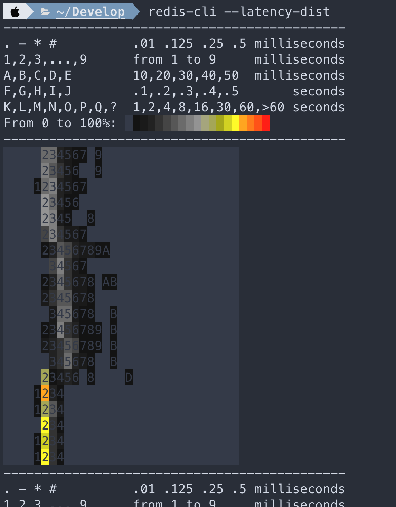
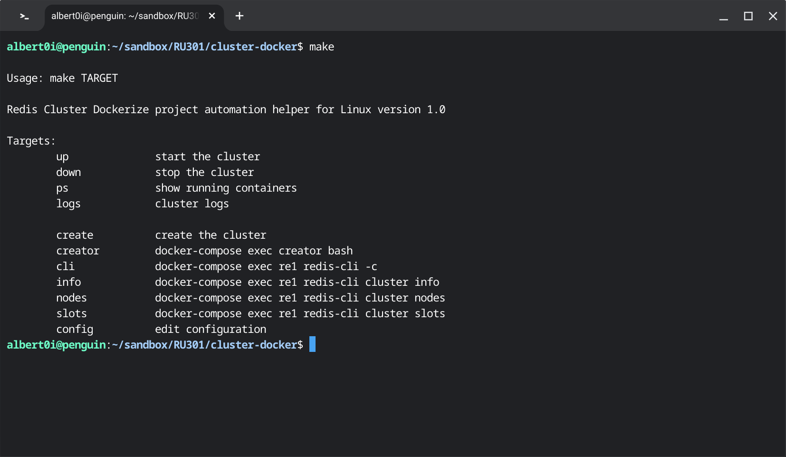
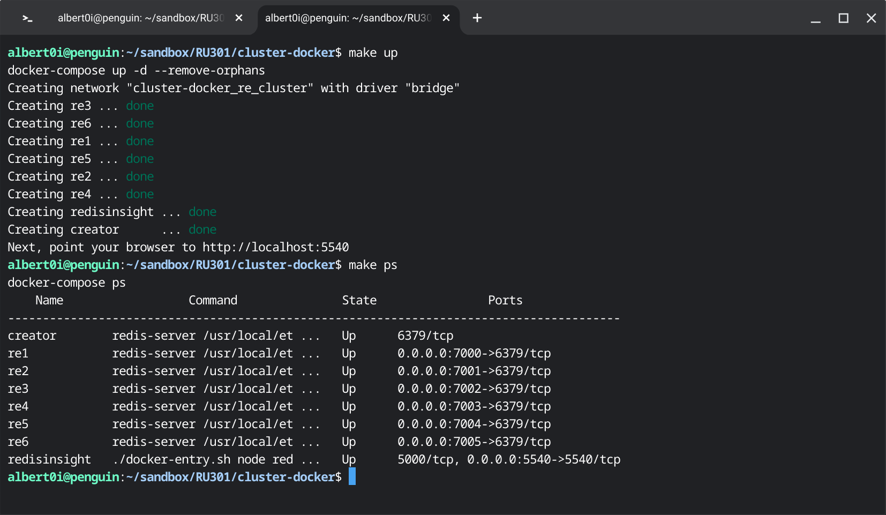
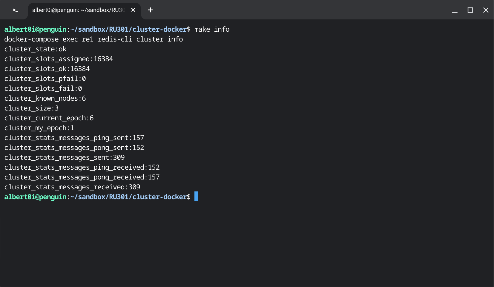
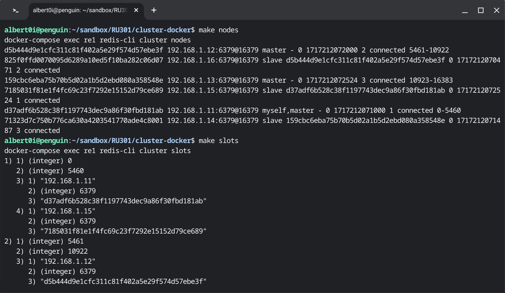

### On Topology (cont) 

### Prologue 
This article is created from transscript of [RU301](https://redis.io/university/courses/ru301/) verbatim, not because of my laziness. But for the great significance and unstirrable value in the aforementioned narrative of the course. Nevertheless links and addenda will be appended whenever it is appropriate. 


### I. Introduction to Observability
The last thing you want to do after successfully deploying and scaling Redis is to be stuck working on the weekend, because performance is down, or the service is unavailable. If you're running a managed service like Redis Cloud, you don't have to worry about these questions as much. But even then, it's still worthwhile to know about certain key Redis metrics.
Some of the questions you always want to be able to answer include--
- is Redis up and running right now?
- Where is my Redis capacity at?
- Is Redis accessible at this moment?
- Is Redis performing the way we expect?
- When failures occur, what exactly happened to Redis?

Then of course, you must ask, how can I find this out ahead of time? Let's dig into these questions more as we look into observability with Redis.


### II. Data Points in Redis
There are several Redis metrics that can be viewed through redis-cli.

#### Redis INFO command
Running the INFO command provides many of the metrics available in a single view.
```
127.0.0.1:6379> INFO
# Server
redis_version:6.0.1
redis_git_sha1:00000000
redis_git_dirty:0
redis_build_id:e02d1d807e41d65
redis_mode:standalone
os:Linux 4.19.121-linuxkit x86_64
…
```

There are several sections that can be pulled individually. For example, if you wanted to just get the ‘clients’ section you can pass that section as an argument to the info command.
```
127.0.0.1:6379> INFO CLIENTS
# Clients
connected_clients:1
client_recent_max_input_buffer:2
client_recent_max_output_buffer:0
blocked_clients:0
tracking_clients:0
clients_in_timeout_table:0
```

#### Sections
**Server**: the current Redis server info.

Metrics of note:

- redis_version
- process_id
- config_file
- uptime_in_seconds
- uptime_in_days

**Clients**: available data on clients connected or failed connections.

Metrics of note:

- connected_clients
- blocked_clients

**Memory**: memory usage and stats

Metrics of note:

- used_memory
- mem_fragmentation_ratio

**Persistence: RDB or AOF metrics

Metrics of note:

- rdb_last_save_time
- rdb_changes_since_last_save
- aof_rewrite_in_progress

**Stats**: some general statistics

Metrics of note:

- keyspace_hits
- keyspace_misses
- expired_keys
- evicted_keys
- instantaneous_ops_per_sec

**Replication**: replication data including primary/replica identifiers and offsets

Metrics of note:

- master_link_down_since
- connected_slaves
- master_last_io_seconds_ago

**CPU**: compute consumption stats

Metrics of note:

- used_cpu_sys
- used_cpu_user

**Modules**: data from any loaded modules

Metrics of note (per module):

- ver
- options

**Cluster**: whether cluster is enabled

Metric of note:

- cluster_enabled

**Keyspace**: keys and expiration data

Metrics of note (per db):

- keys
- expires
- avg_ttl

The output can be read from the results or piped into a file.
```
127.0.0.1:6379> redis-cli INFO STATS > redis-info-stats
```

This could be done at intervals and consumed by a local or third party monitoring service.

Some of the data returned by INFO are going to be static.  For example the Redis version which won't change until an update is made.  Other data is dynamic, for example `keyspace_hits ÷ keyspace_misses`. The latter could be taken to compute a hit ratio and observed as a long term metric. The replication section field `master_link_down_since` could be a metric to connect an alert.

Some examples of possible alerts that could be setup for a given metric:

<table style="width: 100%;">
<tbody>
<tr><th>Metric</th><th>Example Alert</th></tr>
<tr>
<td style="font-family: 'courier new', courier;">uptime_in_seconds</td>
<td>&lt; 300 seconds: to ensure the server is staying up</td>
</tr>
<tr>
<td style="font-family: 'courier new', courier;">connected_clients</td>
<td>&lt; minimum number of expected application connections</td>
</tr>
<tr>
<td style="font-family: 'courier new', courier;">master_link_down_since</td>
<td>&gt; 30 seconds: replication should be operational</td>
</tr>
<tr>
<td style="font-family: 'courier new', courier;">rdb_last_save_time</td>
<td>&gt; maximum acceptable interval without taking a snapshot</td>
</tr>
</tbody>
</table>

**NOTE: This is not an exhaustive list, but just to give you an idea of how the metrics in INFO could be used.**

#### Latency and stats data via redis-cli options
The redis-cli client has some built-in options that allow you to pull some real-time latency and stats data.

Note: these are not available as commands from Redis but as options in redis-cli.

**Latency options**:

Continuously sample latency
```
$ redis-cli --latency
min: 1, max: 17, avg: 4.03 (927 samples)
```

The raw or csv output flag can be added
```
$ redis-cli --latency --csv
1,4,1.94,78
```

In order to sample for longer than one second you can use latency-history which has a default interval of 15 seconds but can be specified using the -i param.
```
$ redis-cli --latency-history -i 60 
min: 1, max: 30, avg: 4.84 (328 samples)
```

This can also be combined with the csv or raw output format flag.
```
$ redis-cli --latency-history -i 60 --csv
13,13,13.00,1
5,13,9.00,2
3,13,7.00,3
3,13,6.00,4
3,13,5.60,5
2,13,5.00,6
2,13,5.43,7
2,13,5.62,8
2,13,5.22,9
2,13,5.00,10
1,13,4.64,11
…
```

Both of these could be piped to a file as well.

The latency-dist option shows latency as a spectrum. The default interval is one second but can be changed using the -i param.



**Stats option**:

Get rolling stats from the server using the stat flag.
```
$ redis-cli --stat 
------- data ------ --------------------- load -------------------- - child -
keys       mem      clients blocked requests            connections
4          9.98M    51      0       8168035 (+0)        4132
4          9.98M    51      0       8181542 (+13507)    4132
4          9.98M    51      0       8196100 (+14558)    4132
4          9.98M    51      0       8209794 (+13694)    4132
4          9.98M    51      0       8223420 (+13626)    4132
4          9.98M    51      0       8236624 (+13204)    4132
4          9.98M    51      0       8251376 (+14752)    4132
4          9.98M    51      0       8263417 (+12041)    4182
4          9.98M    51      0       8276781 (+13364)    4182
4          9.90M    51      0       8289693 (+12912)    4182
```

**Memory stats**
Redis includes a MEMORY command that includes a subcommand to get stats.
```                                                                       
127.0.0.1:6379> memory stats
 1) "peak.allocated"
 2) (integer) 11912984
 3) "total.allocated"
 4) (integer) 8379168
 5) "startup.allocated"
 6) (integer) 5292168
 7) "replication.backlog"
 8) (integer) 0
 9) "clients.slaves"
10) (integer) 0
11) "clients.normal"
12) (integer) 16986
13) "aof.buffer"
14) (integer) 0
```

These values are available in the `INFO MEMORY` command as well, but here they are returned in a typical Redis RESP Array reply.

There is also a `LATENCY DOCTOR` subcommand with an analysis report of the current memory metrics.

#### Latency Monitoring
As we know Redis is fast and as a result is often used in very extreme scenarios where low latency is a must. Redis has a feature called Latency Monitoring which allows you to dig into possible latency issues. Latency monitoring is composed of the following conceptual parts:

- Latency hooks that sample different latency sensitive code paths.
- Time series recording of latency spikes split by different events.
- A reporting engine to fetch raw data from the time series.
- Analysis engine to provide human readable reports and hints according to the measurements.

By default this feature is disabled because most of the time it is not needed. In order to enable it you can update the threshold time in milliseconds that you want to monitor in your Redis configuration. Events that take longer than the threshold will be logged as latency spikes. The threshold configuration should be set accordingly if the requirement is to identify all events blocking the server for a time of 10 milliseconds or more.
```
latency-monitor-threshold 10
```

If the debugging session is intended to be temporary the threshold can be set via redis-cli.

127.0.0.1:6379> CONFIG SET latency-monitor-threshold 10
To disable the latency framework the threshold should be set back to 0.
```
127.0.0.1:6379> CONFIG SET latency-monitor-threshold 0
```

The latency data can be viewed using the `LATENCY` command with it's subcommands:

- LATENCY LATEST - latest samples for all events
- LATENCY HISTORY - latest time series for a given event
- LATENCY RESET - resets the time series data
- LATENCY GRAPH - renders an ASCII-art graph
- LATENCY DOCTOR - analysis report

In order to make use of these commands you need to make yourself familiar with the different events that the latency monitoring framework is tracking. (taken from https://redis.io/topics/latency-monitor)

<table style="width: 100%;">
<tbody>
<tr><th>Event</th><th>Description</th></tr>
<tr>
<td style="font-family: 'courier new', courier;">command</td>
<td>regular commands</td>
</tr>
<tr>
<td style="font-family: 'courier new', courier;">fast-command</td>
<td><span style="font-family: 'courier new', courier;">O(1)</span> and <span style="font-family: 'courier new', courier;">O(log N)</span> commands</td>
</tr>
<tr>
<td style="font-family: 'courier new', courier;">fork</td>
<td>the <span style="font-family: 'courier new', courier;">fork(2)</span> system call</td>
</tr>
<tr>
<td style="font-family: 'courier new', courier;">comrdb-unlink-temp-file</td>
<td>the <span style="font-family: 'courier new', courier;">unlink(2)</span> system call</td>
</tr>
<tr>
<td style="font-family: 'courier new', courier;">aof-write</td>
<td>writing to the AOF - a catchall event <span style="font-family: 'courier new', courier;">fsync(2)</span> system calls</td>
</tr>
<tr>
<td style="font-family: 'courier new', courier;">aof-fsync-always</td>
<td>the <span style="font-family: 'courier new', courier;">fsync(2)</span> system call when invoked by the appendfsync allways policy</td>
</tr>
<tr>
<td style="font-family: 'courier new', courier;">aof-write-pending-fsync</td>
<td>the <span style="font-family: 'courier new', courier;">fsync(2)</span> system call when there are pending writes</td>
</tr>
<tr>
<td style="font-family: 'courier new', courier;">aof-write-active-child</td>
<td>the <span style="font-family: 'courier new', courier;">fsync(2)</span> system call when performed by a child process</td>
</tr>
<tr>
<td style="font-family: 'courier new', courier;">aof-write-alone</td>
<td>the <span style="font-family: 'courier new', courier;">fsync(2)</span> system call when performed by the main process</td>
</tr>
<tr>
<td style="font-family: 'courier new', courier;">aof-fstat</td>
<td>the <span style="font-family: 'courier new', courier;">fstat(2)</span> system call</td>
</tr>
<tr>
<td style="font-family: 'courier new', courier;">aof-rename</td>
<td>the <span style="font-family: 'courier new', courier;">rename(2)</span> system call for renaming the temporary file after completing <span style="font-family: 'courier new', courier;">BGREWRITEAOF</span></td>
</tr>
<tr>
<td style="font-family: 'courier new', courier;">aof-rewrite-diff-write</td>
<td>writing the differences accumulated while performing <span style="font-family: 'courier new', courier;">BGREWRITEAOF</span></td>
</tr>
<tr>
<td style="font-family: 'courier new', courier;">active-defrag-cycle</td>
<td>the active defragmentation cycle</td>
</tr>
<tr>
<td style="font-family: 'courier new', courier;">expire-cycle</td>
<td>the expiration cycle</td>
</tr>
<tr>
<td style="font-family: 'courier new', courier;">eviction-cycle</td>
<td>the eviction cycle</td>
</tr>
<tr>
<td style="font-family: 'courier new', courier;">eviction-del</td>
<td>deletes during the eviction cycle</td>
</tr>
</tbody>
</table>

For example, you can use the `LATENCY LATEST` subcommand and you may see some data like this:
```
127.0.0.1:6379> latency latest
1) 1) "command"
   2) (integer) 1616372606
   3) (integer) 600
   4) (integer) 600
2) 1) "fast-command"
   2) (integer) 1616372434
   3) (integer) 12
   4) (integer) 12
```

The results of this command provide the timestamp, latency and max latency for this event. Utilizing the events table above I can see we had latency spikes for a regular command with the latest and max latency of 600 MS while a O(1) or O(log N) command had a latency spike of 12 MS.

Some of the latency commands require a specific event be passed.
```
127.0.0.1:6379> latency graph command
command - high 600 ms, low 100 ms (all time high 600 ms)
--------------------------------------------------------------------------------
    _##
   o|||
  o||||
_#|||||

3222184
05308ss
sssss
```

While the cost of enabling latency monitoring is near zero and memory requirements are very small it will raise your baseline memory usage so if you are getting the required performance out of Redis there is no need to leave this enabled.

#### Monitoring Tools
There are many open source monitoring tools and services to visualize your Redis metrics - some of which also provide alerting capabilities.

One example of this is the Redis Data Source for Grafana. It is a Grafana plug-in that allows users to connect to the Redis database and build dashboards to easily observe Redis data. It provides an out-of-the-box predefined dashboard but also lets you build customized dashboards tuned to your specific needs.


### III. Getting Redis Statistics
#### Starting Environment
```
$ docker-compose up -d
```

#### Connect to the Environment
In a terminal run this command to get a shell prompt inside the running docker container:
```
$ docker-compose exec redis_stats bash
```

#### Generate load
A simple way to to generate some load is to open another terminal and run:
```
$ docker-compose exec redis_stats redis-benchmark
```

#### Info
Since most of the stats data comes from the INFO command you should first run this to view that there.
```
$ redis-cli INFO
```
Try piping this output to a file.

#### Memory usage
Since we generally recommend setting the maxmemory size, it is possible to calculate the percentage of memory in use and alert based on results of the maxmemory configuration value and the used_memory stat.

First set the maxmemory.
```
$ redis-cli config set maxmemory 100000
```

Then you can pull the two data points to see how that could be used to calculate memory usage.
```
$ redis-cli INFO | grep used_memory:
$ redis-cli CONFIG GET maxmemory
```

#### Client data
You can pull the clients section of the INFO command:
```
$ redis-cli info clients
```

or maybe a particular metric you would want to track:
```
$ redis-cli info clients | grep connected_clients
```

#### Stats section
Use redis-cli to list the full 'stats' section.

#### Hit ratio
A cache hit/miss ratio could be generated using two data points in the stats section.
```
$ redis-cli INFO stats | grep keyspace 
```

#### Evicted keys
Eviction occurs when redis has reached its maximum memory and maxmemory-policy in redis.conf is set to something other than volatile-lru.
```
$ redis-cli INFO stats | grep evicted_keys
```

#### Expired keys
It is a good idea to keep an eye on the expirations to make sure redis is performing as expected.
```
$ redis-cli INFO stats | grep expired_keys
```

#### Keyspace
The following data could be used for graphing the size of the keyspace as a quick drop or spike in the number of keys is a good indicator of issues.
```
$ redis-cli INFO keyspace
```

#### Workload (connections received, commands processed)
The following stats are a good indicator of workload on the Redis server.
```
$ redis-cli INFO stats | egrep "^total_"
```


### IV. Identifying Issues
Besides the metrics from the data points from info, memory and the latency framework in the sections above, you may need to pull data from other sources when troubleshooting.

#### Availability
The redis server will respond to the PING command when running properly:
```
$ redis-cli -h redis.example.com -p 6379 PING
PONG
```

#### Slowlog
Redis Slow Log is a system to log queries that exceed a specific execution time which does not include I/0 operations like client communication. It is enabled by default with two configuration parameters.
```
slowlog-log-slower-than 1000000
```

This indicates if there is an execution time longer than the time in microseconds, in this case one second, it will be logged. The slowlog can be disabled using a value of -1. It can also be set to log every command with a value of 0.
```
slowlog-max-len 128
```

This sets the length of the slow log. When a new command is logged the oldest one is removed from the queue.

These values can also be changed at runtime using the `CONFIG SET` command.

You can view the current length of the slow log using the LEN subcommand:
```
redis.cloud:6379> slowlog len
(integer) 11
```

Entries can be pulled off of the slow log using the `GET` subcommand.
```
redis.cloud:6379> slowlog get 2
1) 1) (integer) 10
   2) (integer) 1616372606
   3) (integer) 600406
   4) 1) "debug"
      2) "sleep"
      3) ".6"
   5) "172.17.0.1:60546"
   6) ""
2) 1) (integer) 9
   2) (integer) 1616372602
   3) (integer) 600565
   4) 1) "debug"
      2) "sleep"
      3) ".6"
   5) "172.17.0.1:60546"
   6) ""
```

The slow log can be reset using the RESET subcommand.
```
redis.cloud:6379> slowlog reset
OK
redis.cloud:6379> slowlog len
(integer) 0
```

#### Scanning keys
There are a few options that can be passed to redis-cli that will trigger a keyspace analysis. They use the SCAN command so they should be safe to run without impacting operations. You can see in the output of all of them there is a throttling option if needed.

**Big Keys**: This option will scan the dataset for big keys and provide information about them.
```
$ redis-cli --bigkeys 

# Scanning the entire keyspace to find biggest keys as well as
# average sizes per key type.  You can use -i 0.1 to sleep 0.1 sec
# per 100 SCAN commands (not usually needed).

[00.00%] Biggest string found so far '"counter:__rand_int__"' with 6 bytes
[00.00%] Biggest hash   found so far '"myhash"' with 1 fields
[00.00%] Biggest list   found so far '"mylist"' with 200000 items

-------- summary -------

Sampled 4 keys in the keyspace!
Total key length in bytes is 48 (avg len 12.00)

Biggest   list found '"mylist"' has 200000 items
Biggest   hash found '"myhash"' has 1 fields
Biggest string found '"counter:__rand_int__"' has 6 bytes

1 lists with 200000 items (25.00% of keys, avg size 200000.00)
1 hashs with 1 fields (25.00% of keys, avg size 1.00)
2 strings with 9 bytes (50.00% of keys, avg size 4.50)
0 streams with 0 entries (00.00% of keys, avg size 0.00)
0 sets with 0 members (00.00% of keys, avg size 0.00)
0 zsets with 0 members (00.00% of keys, avg size 0.00)
```

**Mem Keys**: Similarly to big keys mem keys will look for the biggest keys but also report on the average sizes.
```
$ redis-cli --memkeys

# Scanning the entire keyspace to find biggest keys as well as
# average sizes per key type.  You can use -i 0.1 to sleep 0.1 sec
# per 100 SCAN commands (not usually needed).

[00.00%] Biggest string found so far '"counter:__rand_int__"' with 62 bytes
[00.00%] Biggest string found so far '"key:__rand_int__"' with 63 bytes
[00.00%] Biggest hash   found so far '"myhash"' with 86 bytes
[00.00%] Biggest list   found so far '"mylist"' with 860473 bytes

-------- summary -------

Sampled 4 keys in the keyspace!
Total key length in bytes is 48 (avg len 12.00)

Biggest   list found '"mylist"' has 860473 bytes
Biggest   hash found '"myhash"' has 86 bytes
Biggest string found '"key:__rand_int__"' has 63 bytes

1 lists with 860473 bytes (25.00% of keys, avg size 860473.00)
1 hashs with 86 bytes (25.00% of keys, avg size 86.00)
2 strings with 125 bytes (50.00% of keys, avg size 62.50)
0 streams with 0 bytes (00.00% of keys, avg size 0.00)
0 sets with 0 bytes (00.00% of keys, avg size 0.00)
0 zsets with 0 bytes (00.00% of keys, avg size 0.00)
```

**Hot Keys**: The hot keys scan is only available when the `maxmemory-policy` is set to `volatile-lfu` or `allkeys-lfu`. If you need to identity hot keys you can add this argument to redis-cli.
```
$ redis-cli --hotkeys

# Scanning the entire keyspace to find hot keys as well as
# average sizes per key type.  You can use -i 0.1 to sleep 0.1 sec
# per 100 SCAN commands (not usually needed).

[00.00%] Hot key '"key:__rand_int__"' found so far with counter 37

-------- summary -------

Sampled 5 keys in the keyspace!
hot key found with counter: 37  keyname: "key:__rand_int__"
```

**Monitor**: The MONITOR command allows you to see a stream of every command running against your Redis instance.
```
127.0.0.1:6379 > monitor
OK
1616541192.039933 [0 127.0.0.1:57070] "PING"
1616541276.052331 [0 127.0.0.1:57098] "set" "user:2398423hu" "KutMo"
```

**Note: because MONITOR streams back all commands, its use comes at a cost. It has been known to reduce performance by up to 50% so use with caution!**

#### Setting up and using the Redis Log File
The Redis log file is the other important log you need to be aware of. It contains useful information for troubleshooting configuration and deployment errors. If you don't configure Redis logging, troubleshooting will be significantly harder.

Redis has four logging levels, which you can configure directly in `redis.conf` file.

Log Levels:

- WARNING
- NOTICE
- VERBOSE
- DEBUG

Redis also supports sending the log files to a remote logging server through the use of syslog.

Remote logging is important to many security professionals. These remote logging servers are frequently used to monitor security events and manage incidents. These centralized log servers perform three common functions: ensure the integrity of your log files, ensure that logs are retained for a specific period of time, and to correlate logs against other system logs to discover potential attacks on your infrastructure.

Let's set up logging on our Redis deployment. First we'll open our `redis.conf` file
```
$ sudo vi /etc/redis/redis.conf
```

The `redis.conf` file has an entire section dedicated to logging.

First, find the logfile directive in the `redis.conf` file. This will allow you to define the logging directory. For this example lets use `/var/log/redis/redis.log`.

If you'd like to use a remote logging server, then you'll need to uncomment the lines `syslog-enabled`, `syslog-ident` and `syslog-facility`, and ensure that `syslog-enabled` is set to yes.

Next, we'll restart the Redis server.

You should see the log events indicating that Redis is starting.
```
$ sudo tail -f /var/log/redis/redis.log
```

And next let's check that we are properly writing to syslog. You should see these same logs.

```
$ less /var/log/syslog | grep redis
```

Finally, you’ll need to send your logs to your remote logging server to ensure your logs will be backed up to this server. To do this, you’ll also have to modify the rsyslog configuration. This configuration varies depending on your remote logging server provider.


### V. Docker environment
To put things on the right track, you should always consult `redis.conf`.
```
########################## CLUSTER DOCKER/NAT support  ########################

# In certain deployments, Redis Cluster nodes address discovery fails, because
# addresses are NAT-ted or because ports are forwarded (the typical case is
# Docker and other containers).
#
# In order to make Redis Cluster working in such environments, a static
# configuration where each node knows its public address is needed. The
# following four options are used for this scope, and are:
#
# * cluster-announce-ip
# * cluster-announce-port
# * cluster-announce-tls-port
# * cluster-announce-bus-port
#
# Each instructs the node about its address, client ports (for connections
# without and with TLS) and cluster message bus port. The information is then
# published in the header of the bus packets so that other nodes will be able to
# correctly map the address of the node publishing the information.
#
# If tls-cluster is set to yes and cluster-announce-tls-port is omitted or set
# to zero, then cluster-announce-port refers to the TLS port. Note also that
# cluster-announce-tls-port has no effect if tls-cluster is set to no.
#
# If the above options are not used, the normal Redis Cluster auto-detection
# will be used instead.
#
# Note that when remapped, the bus port may not be at the fixed offset of
# clients port + 10000, so you can specify any port and bus-port depending
# on how they get remapped. If the bus-port is not set, a fixed offset of
# 10000 will be used as usual.
#
# Example:
#
# cluster-announce-ip 10.1.1.5
# cluster-announce-tls-port 6379
# cluster-announce-port 0
# cluster-announce-bus-port 6380
```

and official documentation. 

[Configuring replication in Docker and NAT](https://redis.io/docs/latest/operate/oss_and_stack/management/replication/)

When Docker, or other types of containers using port forwarding, or Network Address Translation is used, Redis replication needs some extra care, especially when using Redis Sentinel or other systems where the master [INFO](https://redis.io/commands/info) or [ROLE](https://redis.io/commands/role) commands output is scanned to discover replicas' addresses.

The problem is that the [ROLE](https://redis.io/commands/role) command, and the replication section of the [INFO](https://redis.io/commands/info) output, when issued into a master instance, will show replicas as having the IP address they use to connect to the master, which, in environments using NAT may be different compared to the logical address of the replica instance (the one that clients should use to connect to replicas).

Similarly the replicas will be listed with the listening port configured into `redis.conf`, that may be different from the forwarded port in case the port is remapped.

To fix both issues, it is possible, since Redis 3.2.2, to force a replica to announce an arbitrary pair of IP and port to the master. The two configurations directives to use are:
```
replica-announce-ip 5.5.5.5
replica-announce-port 1234
```


### VI. Replication with Sentinels 


### VII. Clustering In Redis
conf/redis.conf
```
# redis.conf file

cluster-enabled yes
cluster-config-file nodes.conf
cluster-node-timeout 5000

# Note that you must specify a directory here, not a file name.
dir /data

# Enable AOF file persistence
appendonly yes

# You can set these explicitly by uncommenting the following line.
save 3600 1 300 100 60 10000

# appendfsync always
appendfsync everysec

# 
protected-mode no
stop-writes-on-bgsave-error yes
```

.env 
```
# image name
IMAGE_NAME=redis/redis-stack-server

# image version
IMAGE_VERSION=6.2.6-v12
```

Makefile
```
#
# Import and expose environment variables
#
cnf ?= .env
include $(cnf)
export $(shell sed 's/=.*//' $(cnf))

#
# Main
#
.PHONY: help build up down ps logs 

help:
	@echo
	@echo "Usage: make TARGET"
	@echo
	@echo "Redis Cluster Dockerize project automation helper for Linux version 1.0"
	@echo
	@echo "Targets:"
	@echo "	up  		start the cluster"
	@echo "	down 		stop the cluster"
	@echo "	ps 		show running containers"
	@echo "	logs		cluster logs"
	@echo 
	@echo "	create		create the cluster"
	@echo "	creator		docker-compose exec creator bash"
	@echo "	cli 		docker-compose exec re1 redis-cli -c"
	@echo "	info		docker-compose exec re1 redis-cli cluster info"
	@echo "	nodes		docker-compose exec re1 redis-cli cluster nodes"
	@echo "	slots		docker-compose exec re1 redis-cli cluster slots"
	@echo "	config		edit configuration"

up:
	docker-compose up -d --remove-orphans
	@echo "Next, point your browser to http://localhost:5540"

down:
	docker-compose down -v

ps:
	docker-compose ps

logs:
	docker-compose logs 

create: 
	docker-compose exec creator redis-cli --cluster create 192.168.1.11:6379 192.168.1.12:6379 \
	192.168.1.13:6379 192.168.1.14:6379 192.168.1.15:6379 192.168.1.16:6379 \
	--cluster-replicas 1

creator:
	docker-compose exec creator bash

cli:
	docker-compose exec re1 redis-cli -c 

bash:
	docker-compose exec re1 bash

info:	
	docker-compose exec re1 redis-cli cluster info
	
nodes:	
	docker-compose exec re1 redis-cli cluster nodes

slots:	
	docker-compose exec re1 redis-cli cluster slots

config:
	nano .env
```

docker-compose.yml
```
version: "3"

networks:
  re_cluster:
    driver: bridge
    ipam:
      driver: default
      config:
        - subnet: "192.168.1.0/24"

services:
  #Node 1
  re1:
    image: ${IMAGE_NAME}:${IMAGE_VERSION}
    ports:
      - 7000:6379
    container_name: re1
    restart: unless-stopped    
    volumes:
      - ./conf:/usr/local/etc/redis:ro
      - ./7000:/data:rw
    command: ["redis-server", "/usr/local/etc/redis/redis.conf"]
    networks:
      re_cluster:
        ipv4_address: 192.168.1.11

  #Node 2
  re2:
    image: ${IMAGE_NAME}:${IMAGE_VERSION}
    ports:
      - 7001:6379
    container_name: re2
    restart: unless-stopped    
    volumes:
      - ./conf:/usr/local/etc/redis:ro
      - ./7001:/data:rw
    command: ["redis-server", "/usr/local/etc/redis/redis.conf"]
    networks:
      re_cluster:
        ipv4_address: 192.168.1.12

  #Node 3
  re3:
    image: ${IMAGE_NAME}:${IMAGE_VERSION}
    ports:
      - 7002:6379
    container_name: re3
    restart: unless-stopped    
    volumes:
      - ./conf:/usr/local/etc/redis:ro
      - ./7002:/data:rw
    command: ["redis-server", "/usr/local/etc/redis/redis.conf"]
    networks:
      re_cluster:
        ipv4_address: 192.168.1.13

#Node 4
  re4:
    image: ${IMAGE_NAME}:${IMAGE_VERSION}
    ports:
      - 7003:6379
    container_name: re4
    restart: unless-stopped    
    volumes:
      - ./conf:/usr/local/etc/redis:ro
      - ./7003:/data:rw
    command: ["redis-server", "/usr/local/etc/redis/redis.conf"]
    networks:
      re_cluster:
        ipv4_address: 192.168.1.14

#Node 5
  re5:
    image: ${IMAGE_NAME}:${IMAGE_VERSION}
    ports:
      - 7004:6379
    container_name: re5
    restart: unless-stopped    
    volumes:
      - ./conf:/usr/local/etc/redis:ro
      - ./7004:/data:rw
    command: ["redis-server", "/usr/local/etc/redis/redis.conf"]
    networks:
      re_cluster:
        ipv4_address: 192.168.1.15

#Node 6
  re6:
    image: ${IMAGE_NAME}:${IMAGE_VERSION}
    ports:
      - 7005:6379
    container_name: re6
    restart: unless-stopped    
    volumes:
      - ./conf:/usr/local/etc/redis:ro
      - ./7005:/data:rw
    command: ["redis-server", "/usr/local/etc/redis/redis.conf"]
    networks:
      re_cluster:
        ipv4_address: 192.168.1.16

#Creator
  creator:
    image: ${IMAGE_NAME}:${IMAGE_VERSION}
    container_name: creator
    restart: unless-stopped    
    volumes:
      - ./conf:/usr/local/etc/redis:ro
    command: ["redis-server", "/usr/local/etc/redis/redis.conf"]
    networks:
      re_cluster:
        ipv4_address: 192.168.1.199
    depends_on:
      - re1
      - re2
      - re3
      - re4
      - re5
      - re6

# Redis Insight
  redisinsight:
    image: redis/redisinsight:2.50
    container_name: redisinsight
    ports:
      - 5540:5540
    restart: unless-stopped    
    volumes:
      - ./5540:/data:rw
    networks:
      re_cluster:
        ipv4_address: 192.168.1.198
    depends_on:
      - re1
      - re2
      - re3
      - re4
      - re5
      - re6
```










### VIII. Summary 
And this concludes my Redis collection: 

1. [Redis Stack aggregation pipeline, 2024/03/20](https://github.com/Albert0i/Redis-Stack-Tutorial/blob/main/README.md)
2. [Thinking in Redis, 2024/04/01](https://github.com/Albert0i/Redis-Stack-Tutorial/blob/main/docdb.md)
3. [Data 101, 2024/04/19](https://github.com/Albert0i/RU204/blob/main/Data101.md)
4. [OM vs ORM, 2024/04/30](https://github.com/Albert0i/RU204/blob/main/om-orm.md)
5. [Fun With Cache, 2024/05/17](https://github.com/Albert0i/RU204/blob/main/cache.md)
6. [Far side of the Moon, 2024/05/17](https://github.com/Albert0i/RU204/blob/main/moon.md)
7. [The Road So Far, 2024/06/04](https://github.com/Albert0i/RU301/blob/main/topology1.md)
8. [Tune before you scale, 2024/06/05](https://github.com/Albert0i/RU301/blob/main/topology1.5.md)
9. [On Topology, 2024/06/07](https://github.com/Albert0i/RU301/blob/main/topology2.md)
10. [On Topology (cont), 2024/06/14](https://github.com/Albert0i/RU301/blob/main/topology3.md)

Unless... unless somwthing fanciful emerges in my brain... 


### IX. Bibliography 
1. [Running Redis at scale, Redis University](https://redis.io/university/courses/ru301/)
2. [Redis configuration file example](https://redis.io/docs/latest/operate/oss_and_stack/management/config-file/)
3. [Redis replication](https://redis.io/docs/latest/operate/oss_and_stack/management/replication/)
4. [Sentinel client spec](https://redis.io/docs/latest/develop/reference/sentinel-clients/)
5. [Scale with Redis Cluster](https://redis.io/docs/latest/operate/oss_and_stack/management/scaling/)
6. [Redis Cluster Specification](https://redis-doc-test.readthedocs.io/en/latest/topics/cluster-spec/#overview-of-redis-cluster-main-components)
7. [Hash Slot Resharding and Rebalancing for Redis Cluster](https://severalnines.com/blog/hash-slot-resharding-and-rebalancing-redis-cluster/)
8. [Node-Redis](https://www.npmjs.com/package/redis)
9. [ioredis](https://www.npmjs.com/package/ioredis)
10. [Christabel, BY SAMUEL TAYLOR COLERIDGE](https://www.poetryfoundation.org/poems/43971/christabel)


### Epilogue 
It's you who controls it? or it controls you? 


### EOF (2024/06/14)
