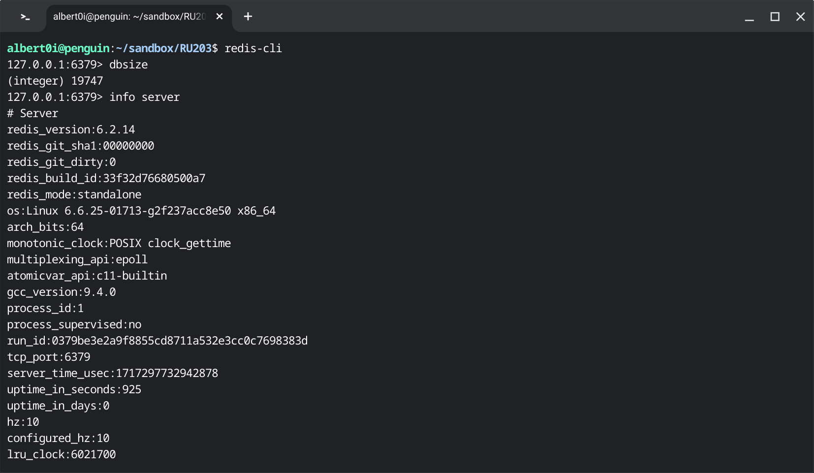
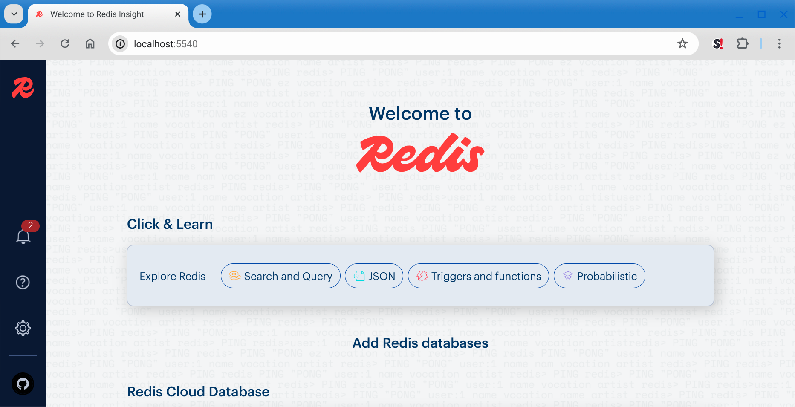

### On Topology (cont) 

### Prologue 
This article is created from transscript of [RU301](https://redis.io/university/courses/ru301/) verbatim, not because of my laziness. But for the great significance and unstirrable value in the aforementioned narrative of the course. Nevertheless links and addenda will be appended whenever it is appropriate. 


### I. Introduction 
To put things on the right track, you should always consult `redis.conf`... 
```
########################## CLUSTER DOCKER/NAT support  ########################

# In certain deployments, Redis Cluster nodes address discovery fails, because
# addresses are NAT-ted or because ports are forwarded (the typical case is
# Docker and other containers).
#
# In order to make Redis Cluster working in such environments, a static
# configuration where each node knows its public address is needed. The
# following four options are used for this scope, and are:
#
# * cluster-announce-ip
# * cluster-announce-port
# * cluster-announce-tls-port
# * cluster-announce-bus-port
#
# Each instructs the node about its address, client ports (for connections
# without and with TLS) and cluster message bus port. The information is then
# published in the header of the bus packets so that other nodes will be able to
# correctly map the address of the node publishing the information.
#
# If tls-cluster is set to yes and cluster-announce-tls-port is omitted or set
# to zero, then cluster-announce-port refers to the TLS port. Note also that
# cluster-announce-tls-port has no effect if tls-cluster is set to no.
#
# If the above options are not used, the normal Redis Cluster auto-detection
# will be used instead.
#
# Note that when remapped, the bus port may not be at the fixed offset of
# clients port + 10000, so you can specify any port and bus-port depending
# on how they get remapped. If the bus-port is not set, a fixed offset of
# 10000 will be used as usual.
#
# Example:
#
# cluster-announce-ip 10.1.1.5
# cluster-announce-tls-port 6379
# cluster-announce-port 0
# cluster-announce-bus-port 6380
```

### II. Replication with Sentinels 


### III. Redis Cluster
conf/redis.conf
```
# redis.conf file

cluster-enabled yes
cluster-config-file nodes.conf
cluster-node-timeout 5000

# Note that you must specify a directory here, not a file name.
dir /data

# Enable AOF file persistence
appendonly yes

# You can set these explicitly by uncommenting the following line.
save 3600 1 300 100 60 10000

# appendfsync always
appendfsync everysec

# 
protected-mode no
stop-writes-on-bgsave-error yes
```

.env 
```
# image name
IMAGE_NAME=redis/redis-stack-server

# image version
IMAGE_VERSION=6.2.6-v12
```

Makefile
```
#
# Import and expose environment variables
#
cnf ?= .env
include $(cnf)
export $(shell sed 's/=.*//' $(cnf))

#
# Main
#
.PHONY: help build up down ps logs 

help:
	@echo
	@echo "Usage: make TARGET"
	@echo
	@echo "Redis Cluster Dockerize project automation helper for Linux version 1.0"
	@echo
	@echo "Targets:"
	@echo "	up  		start the cluster"
	@echo "	down 		stop the cluster"
	@echo "	ps 		show running containers"
	@echo "	logs		cluster logs"
	@echo 
	@echo "	create		create the cluster"
	@echo "	creator		docker-compose exec creator bash"
	@echo "	cli 		docker-compose exec re1 redis-cli -c"
	@echo "	info		docker-compose exec re1 redis-cli cluster info"
	@echo "	nodes		docker-compose exec re1 redis-cli cluster nodes"
	@echo "	slots		docker-compose exec re1 redis-cli cluster slots"
	@echo "	config		edit configuration"

up:
	docker-compose up -d --remove-orphans
	@echo "Next, point your browser to http://localhost:5540"

down:
	docker-compose down -v

ps:
	docker-compose ps

logs:
	docker-compose logs 

create: 
	docker-compose exec creator redis-cli --cluster create 192.168.1.11:6379 192.168.1.12:6379 \
	192.168.1.13:6379 192.168.1.14:6379 192.168.1.15:6379 192.168.1.16:6379 \
	--cluster-replicas 1

creator:
	docker-compose exec creator bash

cli:
	docker-compose exec re1 redis-cli -c 

bash:
	docker-compose exec re1 bash

info:	
	docker-compose exec re1 redis-cli cluster info
	
nodes:	
	docker-compose exec re1 redis-cli cluster nodes

slots:	
	docker-compose exec re1 redis-cli cluster slots

config:
	nano .env
```

docker-compose.yml
```
version: "3"

networks:
  re_cluster:
    driver: bridge
    ipam:
      driver: default
      config:
        - subnet: "192.168.1.0/24"

services:
  #Node 1
  re1:
    image: ${IMAGE_NAME}:${IMAGE_VERSION}
    ports:
      - 7000:6379
    container_name: re1
    restart: unless-stopped    
    volumes:
      - ./conf:/usr/local/etc/redis:ro
      - ./7000:/data:rw
    command: ["redis-server", "/usr/local/etc/redis/redis.conf"]
    networks:
      re_cluster:
        ipv4_address: 192.168.1.11

  #Node 2
  re2:
    image: ${IMAGE_NAME}:${IMAGE_VERSION}
    ports:
      - 7001:6379
    container_name: re2
    restart: unless-stopped    
    volumes:
      - ./conf:/usr/local/etc/redis:ro
      - ./7001:/data:rw
    command: ["redis-server", "/usr/local/etc/redis/redis.conf"]
    networks:
      re_cluster:
        ipv4_address: 192.168.1.12

  #Node 3
  re3:
    image: ${IMAGE_NAME}:${IMAGE_VERSION}
    ports:
      - 7002:6379
    container_name: re3
    restart: unless-stopped    
    volumes:
      - ./conf:/usr/local/etc/redis:ro
      - ./7002:/data:rw
    command: ["redis-server", "/usr/local/etc/redis/redis.conf"]
    networks:
      re_cluster:
        ipv4_address: 192.168.1.13

#Node 4
  re4:
    image: ${IMAGE_NAME}:${IMAGE_VERSION}
    ports:
      - 7003:6379
    container_name: re4
    restart: unless-stopped    
    volumes:
      - ./conf:/usr/local/etc/redis:ro
      - ./7003:/data:rw
    command: ["redis-server", "/usr/local/etc/redis/redis.conf"]
    networks:
      re_cluster:
        ipv4_address: 192.168.1.14

#Node 5
  re5:
    image: ${IMAGE_NAME}:${IMAGE_VERSION}
    ports:
      - 7004:6379
    container_name: re5
    restart: unless-stopped    
    volumes:
      - ./conf:/usr/local/etc/redis:ro
      - ./7004:/data:rw
    command: ["redis-server", "/usr/local/etc/redis/redis.conf"]
    networks:
      re_cluster:
        ipv4_address: 192.168.1.15

#Node 6
  re6:
    image: ${IMAGE_NAME}:${IMAGE_VERSION}
    ports:
      - 7005:6379
    container_name: re6
    restart: unless-stopped    
    volumes:
      - ./conf:/usr/local/etc/redis:ro
      - ./7005:/data:rw
    command: ["redis-server", "/usr/local/etc/redis/redis.conf"]
    networks:
      re_cluster:
        ipv4_address: 192.168.1.16

#Creator
  creator:
    image: ${IMAGE_NAME}:${IMAGE_VERSION}
    container_name: creator
    restart: unless-stopped    
    volumes:
      - ./conf:/usr/local/etc/redis:ro
    command: ["redis-server", "/usr/local/etc/redis/redis.conf"]
    networks:
      re_cluster:
        ipv4_address: 192.168.1.199
    depends_on:
      - re1
      - re2
      - re3
      - re4
      - re5
      - re6

# Redis Insight
  redisinsight:
    image: redis/redisinsight:2.50
    container_name: redisinsight
    ports:
      - 5540:5540
    restart: unless-stopped    
    volumes:
      - ./5540:/data:rw
    networks:
      re_cluster:
        ipv4_address: 192.168.1.198
    depends_on:
      - re1
      - re2
      - re3
      - re4
      - re5
      - re6
```







### V. Summary 
And this concludes my Redis collection: 

1. [Redis Stack aggregation pipeline, 2024/03/20](https://github.com/Albert0i/Redis-Stack-Tutorial/blob/main/README.md)
2. [Thinking in Redis, 2024/04/01](https://github.com/Albert0i/Redis-Stack-Tutorial/blob/main/docdb.md)
3. [Data 101, 2024/04/19](https://github.com/Albert0i/RU204/blob/main/Data101.md)
4. [OM vs ORM, 2024/04/30](https://github.com/Albert0i/RU204/blob/main/om-orm.md)
5. [Fun With Cache, 2024/05/17](https://github.com/Albert0i/RU204/blob/main/cache.md)
6. [Far side of the Moon, 2024/05/17](https://github.com/Albert0i/RU204/blob/main/moon.md)
7. [The Road So Far, 2024/06/04](https://github.com/Albert0i/RU301/blob/main/topology1.md)
8. [Tune before you scale, 2024/06/05](https://github.com/Albert0i/RU301/blob/main/topology1.5.md)
9. [On Topology, 2024/06/07](https://github.com/Albert0i/RU301/blob/main/topology2.md)
10. [On Topology (cont), 2024/06/xx](https://github.com/Albert0i/RU301/blob/main/topology3.md)

Unless... unless somwthing fanciful emerges in my brain... 


### VI. Bibliography 
1. [Running Redis at scale, Redis University](https://redis.io/university/courses/ru301/)
2. [Redis configuration file example](https://redis.io/docs/latest/operate/oss_and_stack/management/config-file/)
3. [Redis replication](https://redis.io/docs/latest/operate/oss_and_stack/management/replication/)
4. [Sentinel client spec](https://redis.io/docs/latest/develop/reference/sentinel-clients/)
5. [Scale with Redis Cluster](https://redis.io/docs/latest/operate/oss_and_stack/management/scaling/)
6. [Redis Cluster Specification](https://redis-doc-test.readthedocs.io/en/latest/topics/cluster-spec/#overview-of-redis-cluster-main-components)
7. [Hash Slot Resharding and Rebalancing for Redis Cluster](https://severalnines.com/blog/hash-slot-resharding-and-rebalancing-redis-cluster/)
8. [Node-Redis](https://www.npmjs.com/package/redis)
9. [ioredis](https://www.npmjs.com/package/ioredis)
10. [Christabel, BY SAMUEL TAYLOR COLERIDGE](https://www.poetryfoundation.org/poems/43971/christabel)


### Epilogue 
It's you who controls it? or it controls you? 


### EOF (2024/06/xx)
