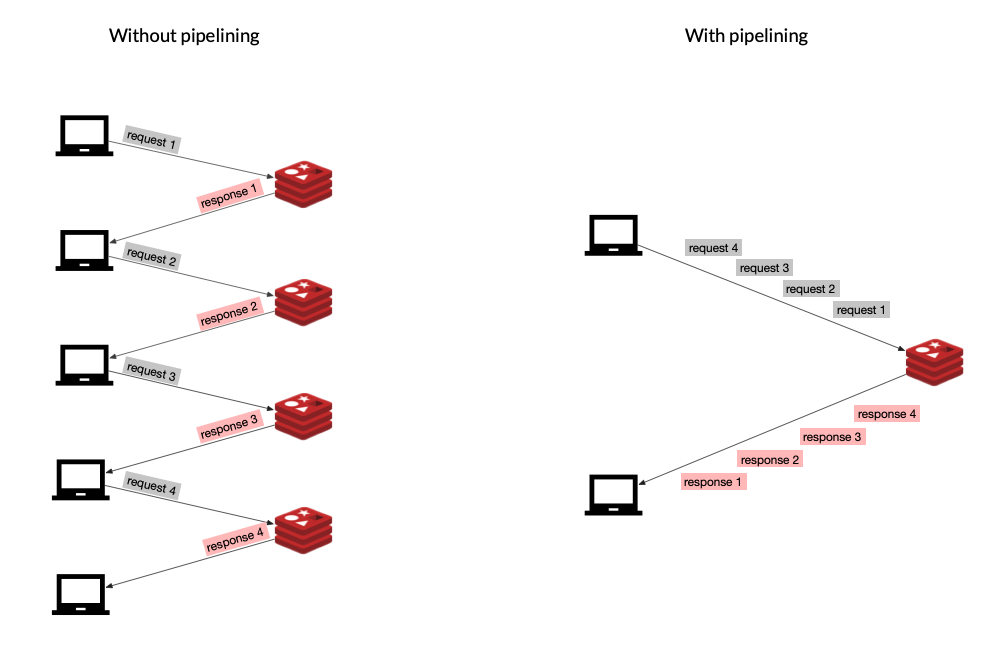

Redis Server Overview
=====================
Learning this isn't just useful, it's
also genuinely interesting.
Sharding, replication, high availability,
and disaster recovery are all important concepts

And knowing about them makes you a better developer.


The speed Redis is famous for is mostly due to the fact
that Redis stores and serves data entirely
from RAM memory instead of disk, as most other databases do.
Another contributing factor is the predominantly
single-threaded nature.

Single threading avoids race conditions
and CPU-heavy context switching associated with threads.
Indeed, this means that open source Redis
can't take advantage of the processing
power of multiple CPU cores, although CPU is rarely
the bottleneck with Redis.

You are more likely to bump up against memory or network
limitations before hitting any CPU limitations.
That said, Redis Enterprise does let
you take advantage of all the cores on a single machine.

The reading and especially writing to a socket
are expensive operations.
So in Redis version 6.0, multi-threaded I/O
was introduced.
When this feature is enabled, Redis
can delegate the time spent reading and writing
to I/O sockets over to other threads,
freeing up cycles for storing and retrieving data,
and boosting overall performance by up to a factor of two
for some workloads.

The Command Line Tool: Redis-CLI
================================

Configuring a Redis Server
==========================
The self-documented Redis configuration file called `redis.conf` has been mentioned many times as an example of well written documentation. In this file you can find all possible Redis configuration directives, together with a detailed description of what they do and their default values.

You should always adjust the `redis.conf` file to your needs and instruct Redis to run based on it's parameters when running Redis in production.

The way to do that is by providing the path to the file when starting up your server:
```
$ redis-server./path/to/redis.conf
```
When you’re only starting a Redis server instance for testing purposes you can pass configuration directives directly on the command line:
```
$ redis-server --port 7000 --replicaof 127.0.0.1:6379
```
The format of the arguments passed via the command line is exactly the same as the one used in the `redis.conf` file, with the exception that the keyword is prefixed with --.

Note that internally this generates an in-memory temporary config file where arguments are translated into the format of `redis.conf`.

It is possible to reconfigure a running Redis server without stopping or restarting it by using the special commands `CONFIG SET` and `CONFIG GET`.
```
127.0.0.1:6379> CONFIG GET *

127.0.0.1:6379> CONFIG SET something

127.0.0.1:6379> CONFIG REWRITE
```
Not all the configuration directives are supported in this way, but you can check the output of the command `CONFIG GET *` first for a list of all the supported ones.

Note that modifying the configuration on the fly has no effects on the `redis.conf` file so at the next restart of Redis the old configuration will be used instead. If you want to force update the `redis.conf` file with your current configuration settings you can run the `CONFIG REWRITE` command, which will automatically scan your `redis.conf` file and update the fields which don't match the current configuration value.


Redis Clients
=============
The Redis.io client page lists over 200 client libraries
for more than 50 programming languages.

Client Performance Improvements
===============================
Connection management - Pooling
As we showed in the previous section, Redis clients are responsible for managing connections to the Redis server. Creating and recreating new connections over and over again, creates a lot of unnecessary load on the server. A good client library will offer some way of optimizing connection management, by setting up a connection pool, for example.

With connection pooling, the client library will instantiate a series of (persistent) connections to the Redis server and keep them open. When the application needs to send a request, the current thread will get one of these connections from the pool, use it, and return it when done.


So if possible, always try to choose a client library that supports pooling connections, because that decision alone can have a huge influence on your system’s performance.

Pipelining
As in any client-server application, Redis can handle many clients simultaneously.

Each client does a (typically blocking) read on a socket and waits for the server response. The server reads the request from the socket, parses it, processes it, and writes the response to the socket. The time the data packets take to travel from the client to the server, and then back again, is called network round trip time, or RTT.

If, for example, you needed to execute 50 commands, you would have to send a request and wait for the response 50 times, paying the RTT cost every single time. To tackle this problem, Redis can process new requests even if the client hasn't already read the old responses. This way, you can send multiple commands to the server without waiting for the replies at all; the replies are read in the end, in a single step.



This technique is called pipelining and is another good way to improve the performance of your system. Most Redis libraries support this technique out of the box.


Initial Tuning
==============
We love Redis because it’s fast (and fun!), so as we begin to consider scaling out Redis, we first want to make sure we've done everything we can to maximize its performance.

Let's start by looking at some important tuning parameters.

`Max Clients`
Redis has a default of max of 10,000 clients; after that maximum has been reached, Redis will respond to all new connections with an error. If you have a lot of connections (or a lot of application instances), then you may need to go higher. You can set the max number of simultaneous clients in the Redis config file:
```
maxclients 20000
```

`Max Memory`
By default, Redis has no max memory limit, so it will use all available system memory. If you are using replication, you will want to limit the memory usage in order to have overhead for replica output buffers. It’s also a good idea to leave memory for the system. Something like 25% overhead. You can update this setting in Redis config file:
```
# memory size in bytes  
maxmemory 1288490188
```

`Set tcp-backlog`
The Redis server uses the value of tcp-backlog to specify the size of the complete connection queue.

Redis passes this configuration as the second parameter of the `listen(int s, int backlog)` call.

If you have many connections, you will need to set this higher than the default of 511. You can update this in Redis config file:
```
# TCP listen() backlog. 
# 
# In high requests-per-second environments you need an high backlog in order 
# to avoid slow clients connections issues. Note that the Linux kernel 
# will silently truncate it to the value of /proc/sys/net/core/somaxconn so 
# make sure to raise both the value of somaxconn and tcp_max_syn_backlog 
# in order to get the desired effect.
tcp-backlog 65536
```
As the comment in `redis.conf` indicates, the value of `somaxconn` and `tcp_max_syn_backlog` may need to be increased at the OS level as well.

`Set read replica configurations`
One simple way to scale Redis is to add read replicas and take load off of the primary. This is most effective when you have a read-heavy (as opposed to write-heavy) workload. You will probably want to have the replica available and still serving stale data, even if the replication is not completed. You can update this in the Redis config:
```
slave-serve-stale-data yes
```
You will also want to prevent any writes from happening on the replicas. You can update this in the Redis config:
```
slave-read-only yes
```

`Kernel memory`
Under high load, occasional performance dips can occur due to memory allocation. This is something Salvatore, the creator of Redis, blogged about in the past. The performance issue is related to transparent hugepages, which you can disable at the OS level if needed.
```
$ echo 'never' > /sys/kernel/mm/transparent_hugepage/enabled
```

`Kernel network stack`
If you plan on handling a large number of connections in a high performance environment, we recommend tuning the following kernel parameters:
```
vm.swappiness=0                       # turn off swapping
net.ipv4.tcp_sack=1                   # enable selective acknowledgements
net.ipv4.tcp_timestamps=1             # needed for selective acknowledgements
net.ipv4.tcp_window_scaling=1         # scale the network window
net.ipv4.tcp_congestion_control=cubic # better congestion algorithm
net.ipv4.tcp_syncookies=1             # enable syn cookies
net.ipv4.tcp_tw_recycle=1             # recycle sockets quickly
net.ipv4.tcp_max_syn_backlog=NUMBER   # backlog setting
net.core.somaxconn=NUMBER             # up the number of connections per port
net.core.rmem_max=NUMBER              # up the receive buffer size
net.core.wmem_max=NUMBER              # up the buffer size for all connections
```

`File descriptor limits`
If you do not set the correct number of file descriptors for the Redis user, you will see errors indicating that “Redis can’t set maximum open files..” You can increase the file descriptor limit at the OS level.

Here's an example on Ubuntu using systemd:
```
/etc/systemd/system/redis.service
[Service] 
... 
User=redis 
Group=redis 
...
LimitNOFILE=65536 
...
```
You will then need to reload the daemon and restart the redis service.

`Enabling RPS (Receive Packet Steering) and CPU preferences`
One way we can improve performance is to prevent Redis from running on the same CPUs as those handling any network traffic. This can be accomplished by enabling RPS for our network interfaces and creating some CPU affinity for our Redis process.

Here is an example. First we can enable RPS on CPUs 0-1:
```
$ echo '3' > /sys/class/net/eth1/queues/rx-0/rps_cpus
```
Then we can set the CPU affinity for redis to CPUs 2-8:
```
# config is set to write pid to /var/run/redis.pid
$ taskset -pc 2-8 `cat /var/run/redis.pid`
pid 8946's current affinity list: 0-8
pid 8946's new affinity list: 2-8
```


[Install Redis on Linux](https://redis.io/docs/latest/operate/oss_and_stack/install/install-redis/install-redis-on-linux/)

[redis-windows](https://github.com/zkteco-home/redis-windows)

[Redis7.2.4-Homebrew](https://github.com/Albert0i/Redis7.2.4-Homebrew.git)


redis:7.2.4-nanoserver-20H2

albert0i/redis
Updated about 1 year ago
Version 3.2.100 on nanoserver (1909)

docker image tag redis:7.2.4-nanoserver-20H2 albert0i/redis:7.2.4-nanoserver-20H2
docker image push albert0i/redis:7.2.4-nanoserver-20H2

Version 7.2.4 on nanoserver (20H2)


docker image pull albert0i/redis:7.2.4-nanoserver-20H2